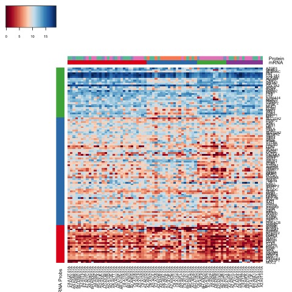
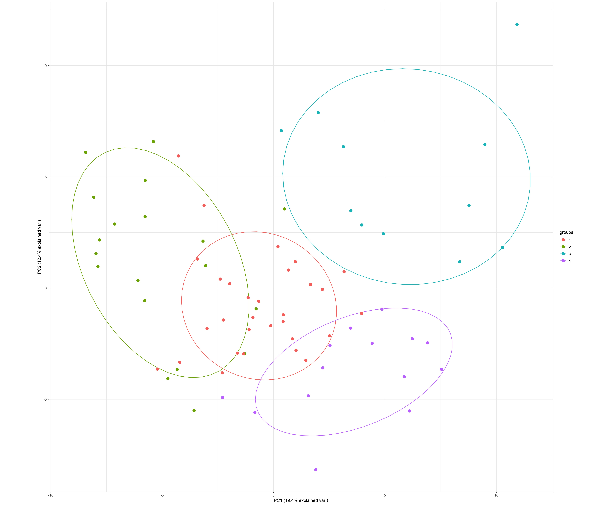
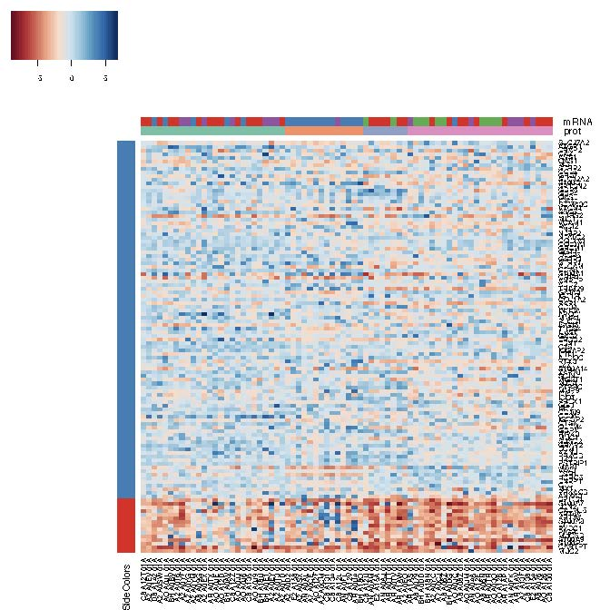
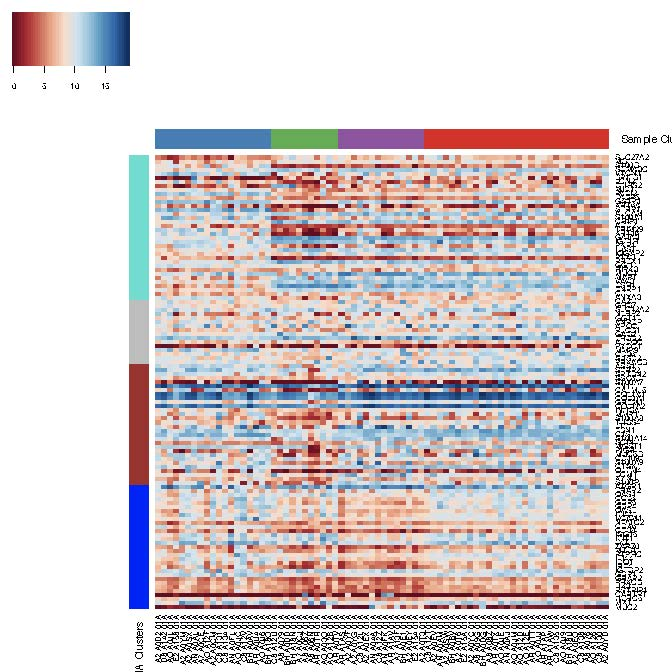

```{r setup, include=FALSE}
knitr::opts_chunk$set(echo = TRUE,fig.width=8, fig.height=6)
```

# Project organization

This document/repository contains my response to Huang Lab assessment project. The github repository contains codes and figures related to the project. In the rest of this document I will first provide a project summary/abstract, as requested in the project description. Then, I will continue by a walk through of my analysis of the project. 

# Project overview (Short Summary)

###Abstract

In this study, we investigate the multi-omics landscape of immunoproteins and cytokines of 74 breast cancer tumors by contrasting mutation, protein expression and mRNA expression data. Our analysis of mRNA expression and protein expression profiles shows four distinct subtypes of cancer tumors from the variational patterns of known immunnoproteins. The biological function associations of the subtypes vary based-on their molecular patterns with known pathways that indicate immune response, cell signaling, and cellular migration. Through differential expression analysis, we identifies a novel TP53 associated interaction network of cytokines and immunoproteins. The network encompasses known molecular that are annotated in biological databses as well as novel interactions that remain to be validated.

### Material and methods
We used a collection of processed and normalized  breast cancer samples of mRNA expressions (n = 74), protein expressions (n = 77), and mutations (n = 73). After initial quality control, we used a substed of differentially variable mRNAs (DVM) by variance filtering. We used Causal Disturbance Analysis (CADIA) for pathway enrichment analysis of DVM to extract biological insight. DVMs were then filtered to an a priori set of annotated immune-related proteins. We then used the intersection of the filtered DVMs and the protein expression signals for identifying the molecular subtypes of the tumor samples. The final set of probes were determined by selecting the gene/protein pairs with statistically significant correlation between their two expression profiles (113 mRNAs).  

We used unsupervised Gaussian Mixture Models (GMM) for identifying distinct tumor subtypes. Bayesian Information Criterion (BIC) was used to determine the optimal number of clusters for GMM. We then used two approaches, hierarchical clustering and WGCNA modules, for identifying probe subgroups. The functional association and interpretation of mRNA and protein probe clusters was done using CADIA pathway analysis. 

On a separate analysis, we contrasted the profiles of mRNA expression between TP53 mutated and non-TP53 samples. Analysis of Variance identifies 308 differentially expressed genes (DEG) with fold-change magnitde more than 1 and Benjamini Hochberg Adjusted p-value <0.005. We filtered the DEG using an apriori list of cytokines and immunoproteins retreived from AmiGO. We then subsetted the filtered DEG to those with with measured protein expressions with statistically significant correlations. The molecular network of subsetted DEG was derived using GENIE3 for inferring interactions. We dervied the interaction network using mRNA data and protein data separately and report the overlap of the two networks. 

### Results and discussion


Model-based clustering using GMM identifies four subgroups in each of the mRNA and protein samples. For mRNA data, hierachical clustering identifies three class of coexpression of mRNAs. Each subtype shows some distinctive pattern acroos the classes that  are associated (Figure 1). 1- Immune response through T cell receptor pathways and Th17 cell differentiation pathway (Red row cluster, Fig.1). 2- Cell singaling through Wnt, Calcium, and Phospholipase D singaling pathways (Blue row cluster, Fig.1). 3- Motility and migration through ECM-receptor interaction and focal adhesion (Green row cluster, Fig.1). Figure 1 shows the heatmap of the mRNA data where the rows represent gene signals and the columns represent the sample. The figure shows a strong overlap between one pair of sample clusters from proteins and mRNA data that corresponds to immune response subclass of probes. Additional analysis using WGCNA also shows the overlap between the functional association of probe sub classes in mRNA and protein data. Figure 2 shows the two dimensional Principal Component map of the samples and the subtypes. Using a three dimensional map (results not shown in summary) further highlights the distinction between the mRNA infered subtypes in both mRNA and protein data.

The TP53 associated differential expression analysis idetifies 17 mRNAs with correlated protein expressions. A query of STRING-DB yeilds nine known interactions for the 17 genes. GENIE3 analysis of coexpression network identifies an interaction map with several interactions including eight out of the nine known interactions. Figure 3 shows the inferred interaction network of TP53 mutation associated differential expressions. 


```{r, echo=FALSE, fig.cap="Figure 1", out.width = '50%'}

```

```{r, echo=FALSE, fig.cap="Figure 2", out.width = '50%'}

```

```{r, echo=FALSE, fig.cap="Figure 3", out.width = '50%'}
knitr::include_graphics("images/CombinedNetworkGENIE3.pdf")
```


# Initial inspection

There are three sets of files that contain mutations profiles, mRNA expressions, and relative protein expressions. The first phase to insepct and pre-process the data sources. For this, I will run some standard procedures to investigate the distributions of individual probes as well as overall sample quality. The first step is data/library loading and a quick peak into the data. 

```{r,  message=FALSE , warning = FALSE}
rm(list = ls())
library(limma)
library(clusterProfiler)
library(org.Hs.eg.db)
library(heatmap3)
library(mclust)
library(CADIA)

# Parsing and inspecting the Mutation, Expression, and Protein Data

mutated    <- read.csv("Data/BRCA_MC3_SOMATIC_formatted_amino_acid.txt",
                       stringsAsFactors = F, sep = "\t", row.names = 1)
expression <- read.csv("Data/BRCA_mRNA_formatted_normalized.txt",
                       stringsAsFactors = F, sep = "\t", row.names = 1)
proteins   <- read.csv("Data/BRCA_PRO_formatted_normalized.txt",
                       stringsAsFactors = F, sep = "\t", row.names = 1)


head(mutated[,1:5],1)
head(proteins[,1:5],3)
head(expression[,1:5],1)

```

## Mutation data initial inspection 

In the mutations data, we have a charachter matrix with entries that are either wild type ('wt') or specific mutations. It is possible for an entry to multiple mutations. For simplicity, I will make a simplifying assumption that different mutations of a gene affect the protein activities in the same manor regardless of number of mutated sites. Using this assumption, I will turn the mutation data into a binary matrix where 1 indicates incidence of a mutation at a specific gene/sample pair, and zero otherwise.

```{r}
    dim(mutated)
    sum(is.na(mutated))
    
    mutated[mutated != "wt"] <- 1
    mutated[mutated == "wt"] <- 0
    
    mutated <- as.data.frame(mutated)
    mutated <- data.matrix(mutated)
    rowSums(mutated)
```


TP53 and PI3KCA are the most frequent mutations across the samples. Just for one quick inspection, let's do some clustering on the mutation matrix and see what comes out. Why doing clustering? maybe finding subgroups that we can further contrast. I am not sure where mutations happen together or correlate, but maybe clusters together can bring some higher level descriptions.

The choice of clustering in this case is hierarchical agglomerative clustering with 1 - spearman correlation as the distance measure and Ward's distance for cluster merging.


```{r}
heatmap3(mutated,scale ="none",distfun = function(x) as.dist(1 - cor(t(x),
         method = "spearman")), method ="ward.D2")
d <- as.dist(1 - cor((mutated), method = "spearman"))
clusters <- hclust(d,method ="ward.D2")
plot(clusters,cex=0.5)
```

Unsprisingly, we can't get much out this heatmap the way it is. The sample clusters are in two groups that are approximately distinct by the TP53 mutations. In an analysis at some later point I will thoroughly investigate the differential profiles associated with TP53 mutations. For now, I will move on to investigate the expression data.


## mRNA expression intitial inspection

Just inspecting the data distribution. We know that the data is normalized. So, there shouldn't be any problems here. Distributions should align. Just to verify.
   
```{r}
plotDensities(expression, legend = F)

```

The density plot of individual mRNA expressions across different samples align and match. This means that large scale correction are not necessary at this point, e.g. dividing sample expressions or scaling. It is expected that boxplots confirm this pattern,

```{r}
boxplot(expression)
```

The boxplot also verifies the normalization of the samples as we see relative aligment between the variances and the means of expressions in each sample. To verify that we have the requirements for differential expression analysis, I will use MD plots.

```{r}
    plotMD(expression,column = 1)
    abline(h=0,col="red")
```

MD plot also shows the symmetry of differential expressions of one sample versus the others. 
The expression data does not need any further large scale normalization at this point. 

```{r}
    means  <- apply(expression, 1, mean)
    vars   <- apply(expression, 1, var)
    sds    <- apply(expression, 1, sd)
    plot(means,vars)
    abline(h=10,col="red")


```

Insepcting the relationship between variances and the means of expressions of the genes. We will later use this to select subsets of genes for differentially variable genes analysis. In the first exploratory analysis, I will focus on highly variable genes and use variance thresholds to identify them. This is a suitable choice when the focus is not on identifying the differences between a priori subsets of samples. It is also possible to use other metrics for finding highly variable genes such as coefficient of variation. However, variance itself seems to be a good choice because the data is already normalized and the variance alone is a good indicator of changes in individual gene levels. 

```{r}
    expression2 <- expression[vars !=0 & means !=0,]
    dim(expression)
    dim(expression2)
```


For the analysis we exclude the genes with zero mean and zero variance.  We see some reduction becasue of zero variance genes. the next step is to identify a variance threshold to identify the differentially variable genes. While it is possible to selected a fixed threshold, e.g. top 500, I will focus on finding the threshold from the data. 
    
```{r}
    plotDensities(vars)
   
    mean(vars)
    sd(vars)
```

Somewhere in (2,3) the second derivative of the density plot of variance becomes positive. Also, it seems that mean + sd for variances falls close to this range. Based on these observations I will pick a conservative threshold of 2 for the rest of analysis. I will use this baseline variance for selecting highly variable genes in the rest of this exploratory analysis

```{r}
expression2 <- expression[vars > 2,]
nrow(expression2)
```


## Protein data inspection

Moving on proteins and prefiltering steps on protein expressions. As we saw, proteins contains a number of missing points. While it's best to use some sort of imputation, I will leave that for future endeavors because I am unfamiliar with this type data. Instead, I will just see if I can filter out the missing genes. 
 
 
```{r}
missings   <- apply(proteins, 1, function(X){
    sum(is.na(X))
})

sum(missings > 0)
```

 There are 3628 proteins with missing values. For now let's settle that the rest of the analysis we do not want the proteins to have missing values. Again, this assumption can be extended to some level missing.
 
```{r}
proteins2   <- proteins
prot.means  <- apply(proteins2, 1, mean, na.rm =T)
prot.vars   <- apply(proteins2, 1, var,  na.rm =T)

sum(is.na(prot.means))
proteins2  <- proteins[!(missings > 0),]

```

Just some data inspection. The normalization is described is the handout so
we should be careful how to analyze and filter.


```{r}
plot(prot.means,prot.vars)

```

The lesson of this plot is that maybe filtering using variance is not the best choice. This lesson fits the nature of the data since every protein level is normalized by dividing on some baseline expression rather than cross sample.

```{r}
plotDensities(proteins2)
```

The density plot shows that even after filtering the proteins with missing values, we still see the patterns of the original signal distributions. Each sample in the original data was Z-normalized. Even after filtering, we see approximately equal means across the samples in the plot. So, the data does not become inconsistent as a result of filtering.


```{r}
boxplot(proteins2)
```

The boxplot also confirms that the data is not much affected by the filtering process. The means of the samples remain to be aligned and close to zero with the size of the boxes being approximately the same. It would be interesting the behaviour of this data using MD plot. 

```{r}
plotMD(proteins2,column = 60)
abline(h=0,col="red")
```

This is so much different from standard MA plot of expression. It is not clear to me for now what can be inferred. Definitely, this plot shows that two-sample testing is perhaps is not a good choice. Also, there is some level of noise the plot, which potentially can be fixed.  Just as a hunch, let's just see what median polish does. Maybe we can get some further normalization. 

```{r}
prot.polish <- medpolish(proteins2, eps = 0.01, maxiter = 10,
                         trace.iter = TRUE,na.rm = F)

plotMD(prot.polish$residuals,column = 60)
boxplot(prot.polish$residuals)
abline(h=0,col="red")
proteins3 <- prot.polish$residuals

```

Not surprinsingly median polish seems to smooth the data. We get a better MA plot that is less noisy. We also get more aligned boxplots. However, I am not sure of the consequences and the indications of this process. So, I will investigate that  some other day in the future. For now, I will just work with the original data. 


# Exploratory Analysis

## Data and library import

Here, I will run an exploratory analysis to see what can be inferred from the data. For this, I will be using the processed data as it was explained before. Some more details can be found in the preprocessing code provided in the file ``PreliminaryInsepction.R``. 


```{r,  message=FALSE , warning = FALSE}

rm(list = ls())
library(limma)
library(clusterProfiler)
library(org.Hs.eg.db)
library(CADIA)
library(dplyr)

# Parsing the cleaned Mutation, Expression, and Protein Data

mutated    <- readRDS("Data/mutationcleaned.rds")
expression <- readRDS("Data/mRNAcleaned.rds")
proteins2  <- readRDS("Data/protcleaned.rds")
```

## Differentially variable genes

As we discussed in the previous section, the range of (2,3) seems like a proper threshold for subsetting variable genes. Here, we select the lower bound to be as inclusive as possible in the analysis.

```{r,  message=FALSE , warning = FALSE}
vars        <- apply(expression, 1, var)
expression1 <- expression[vars > 0,]
expression2 <- expression[vars > 2,]
geneList    <- (rownames(expression1))
deGenes     <- (rownames(expression2))

```


For enrichment analysis, we create appropriate translation lists of variable genes and the universe of genes. 

```{r,  message=FALSE , warning = FALSE}
set.seed(1)
gene.df    <- bitr(geneList, fromType = "SYMBOL",
                   toType = c("ENTREZID","ENSEMBL"),
                   OrgDb = org.Hs.eg.db)
deGenes.df <- bitr(deGenes, fromType = "SYMBOL",
                   toType = c("ENTREZID","ENSEMBL"),
                   OrgDb = org.Hs.eg.db)

```

GO enrichment analysis provides too many terms and does not necessarily give a clear picture of the underlying biological insight as it is. I have included the code chunk here for interested readers, but I will not run it because of the computational cost for the rendering of this document. 

```{r,  message=FALSE , warning = FALSE}
# enriched   <- enrichGO( gene           = deGenes.df$ENSEMBL,
#                          universe      = gene.df$ENSEMBL,
#                          OrgDb         = org.Hs.eg.db,
#                          keyType       = 'ENSEMBL',
#                          ont           = "BP",
#                          pAdjustMethod = "BH",
#                          pvalueCutoff  = 0.05,
#                          readable      = TRUE)
# #
#
# #
#  head(enriched,10)
#  ego <- gofilter(enriched,4)
#  head(ego)
```

Instead of GO enrichment analysis, I will use an enrichment analysis of KEGG pathways to get more focused interpretations.  For pathway analysis, I use my in-house methodology, CADIA. 


```{r,  message=FALSE , warning = FALSE}

##  network based analysis on KEGG pathways using CADIA
set.seed(1)
cadia.res  <- CADIA::causalDisturbance(deGenes.df$ENTREZID,gene.df$ENTREZID,
                                       iter = 5000)

cadia.res %<>% filter(.,cadia < 0.05) %>% select(., Name, KEGGID)
cadia.res
```

 CADIA uniquely identifies enrichment of a number of pathways including Wnt Signaling,and PI3K-Akt signaling pathway which are associated with signaling dysregulations in cancer. The method also detects a range of other cancer-related pathways such as ECM-receptro interactions and cytokine-cytokine receptor interactions.  

 Moving on to proteins analysis. First, I will load a list of immune proteins and align them with the experimental data. The list of the immune proteins were downloaded form AmiGO portal.
 
```{r, message=FALSE , warning = FALSE}
    # Immunoproteins
imm.tab   <- read.csv("Data/immunoproteins",header = F, sep = "\t")
imm.prot  <- as.character(imm.tab$V2)
imm.prot2 <- intersect(imm.prot, rownames(proteins2))

imm.prots.all     <- bitr(imm.prot, fromType = "SYMBOL",
                        toType = c("ENTREZID","ENSEMBL"),
                        OrgDb = org.Hs.eg.db)


```
 
Aligning the two pieces of data using the immunoproteins. I will create two sets of data that have the same list of gene/proteins and the same list of the samples.


```{r}
mRNA.norm <- expression2[intersect(imm.prot2, rownames(expression2)),]
prot.norm <- proteins2[intersect(imm.prot2, rownames(expression2)),]

mRNA.norm <- mRNA.norm[,intersect(colnames(proteins2),
                                  colnames(expression2))]
prot.norm <- prot.norm[,intersect(colnames(proteins2),
                                  colnames(expression2))]


```


Just as quality control and inspection step, I will investigate the correlation between the proteins and mRNAs expressions. For correlation analysis, I will use the peasorn method that is sensitive to the magnitude of the underlying values. I will use the p-value for the correlation test to identify the confidence in the coefficient. 

```{r,  message=FALSE , warning = FALSE}

prot.mRNA.cors <- sapply(1:nrow(mRNA.norm), function(X){
    cor(t(mRNA.norm[X,]),
        t(prot.norm[X,]),
        use='complete.obs')})


prot.mRNA.pvals <- sapply(1:nrow(mRNA.norm), function(X){
    zz <- cor.test(t(mRNA.norm[X,]),
                   t(prot.norm[X,]))
    return(zz$p.value)})


plotDensities(prot.mRNA.cors)
```

The correlation plot shows the distribution of correlation coefficients, most of which are positive. The negative ones are perhaps by random. So we will make sure we filter protein/mRNA associations that are not statistically supported by the correlation (FDR < 0.005). 

```{r}
nrow(mRNA.norm)
ncol(mRNA.norm)

```

We have 163 variable mRNA and proteins signals shared between the two datasets. This is across 74 samples.  So let's use the  quality criteria on the correlations. 


```{r}

prot.mRNA.fdr <- p.adjust(prot.mRNA.pvals)
plotDensities(prot.mRNA.cors[prot.mRNA.fdr < 0.005])
length(prot.mRNA.cors[prot.mRNA.fdr < 0.005])

```

For 113 of the genes, we have a consistent positive correlation. So, I will work on these for the rest of the analysis. We will also filter out the ones with correlations smaller than 0.4. 


```{r}
mRNA.filtered <- mRNA.norm[prot.mRNA.fdr < 0.005 & prot.mRNA.cors > 0.4,]
prot.filtered <- prot.norm[prot.mRNA.fdr < 0.005 & prot.mRNA.cors > 0.4,]
nrow(mRNA.filtered)
```

## Cluster analysis

It is interesting to find what subtypes exist in the data and what biological charachteristics they show. For this, I will start running model-based clustering using Gaussian Mixture Models. GMMs are  well developed and implemented in the ``mclust`` package. 

First, let's identify the number of different clusters using different prior assumptions for clustering. We evaluate the clustering quality and method using Bayesian Information Criterion (BIC).  


```{r,  message=FALSE , warning = FALSE}
library(mclust)

BIC <- mclustBIC(t(mRNA.filtered))
plot(BIC)
summary(BIC)

BIC <- mclustBIC(t(prot.filtered))
plot(BIC)
summary(BIC)

```

The best model for mRNA data according to BIC is four cluster with "VEI" model which gives the highest separations among the subtypes. 

```{r,  message=FALSE , warning = FALSE}
library(mclust)


BIC <- mclustBIC(t(prot.filtered))
plot(BIC)
summary(BIC)

```

The best model for protein data according to BIC is also four cluster with "VEI" model. 

I will use this information to classify the samples. 

```{r}
mod.mRNA <- Mclust(t(mRNA.filtered), G = 4, modelName = "VEI")
mod.prot <- Mclust(t(prot.filtered), G = 4, modelName = "VEI")
```


Moving on to visualization. The model-based clustering was applied to the samples. I will also classify the mRNA expressions according to an agglomerative hierarchical clustering.

```{r}

library(RColorBrewer)

clust.order <- unlist(tapply(1:ncol((mRNA.filtered)),
                             as.factor(mod.mRNA$classification),I)
                      ,use.names = F)
mRNA.mat    <- data.matrix(mRNA.filtered)[,clust.order]


# Just some color setting for visualization
        
        my_group    <- as.numeric(as.factor(mod.mRNA$classification))
        my_col1     <- brewer.pal(8, "Set1")[my_group]
        my_col1     <- my_col1[clust.order]
        
        my_group    <- as.numeric(as.factor(mod.prot$classification))
        my_col2     <- brewer.pal(8, "Set2")[my_group]
        my_col2     <- my_col2[clust.order]
        
        coul        <- colorRampPalette(brewer.pal(10, "RdBu"))(50)
        my_col      <- cbind("mRNA"= my_col1, "Protein" = my_col2)


# Distance based clustering 
        
d  <- dist( data.matrix(mRNA.filtered ), method = "euclidian")
hc <- hclust(d,method = "complete")

plot(hc,labels=rownames(mRNA.filtered),cex=0.5)

```

In hierarchical clustering, three subgroups is a suitable choice for rows (expressions). The following is the coloring and heatmap visualization.  

```{r}
 
    hclusters  <- cutree(hc, h=80)
    row.order  <- unlist(tapply(1:nrow((mRNA.filtered)),
                                 as.factor(hclusters),I),use.names = F)
    
    mRNA.mat   <- mRNA.mat[row.order,]
    
    my_group   <- as.numeric(as.factor(hclusters))
    my_col1    <- brewer.pal(9, "Set1")[my_group]
    my_row_col <- brewer.pal(9, "Set1")[my_group]
    my_row_col <- my_row_col[row.order]

heatmap3(mRNA.mat,Colv = NA,Rowv = NA,showColDendro = F,showRowDendro = F,
          scale = "none", col = coul,RowSideColors =  my_row_col,
          ColSideColors=my_col)

```


It is interesting to see the underlying associated functions of the row clusters. I will use CADIA again to interpret the cluster functions.

```{r,  message=FALSE , warning = FALSE}
clust1 <- names(hclusters[hclusters ==1])
clust2 <- names(hclusters[hclusters ==2])
clust3 <- names(hclusters[hclusters ==3])

gene.clust1     <- bitr(clust1, fromType = "SYMBOL",
                        toType = c("ENTREZID","ENSEMBL"),
                        OrgDb = org.Hs.eg.db)
gene.clust2     <- bitr(clust2, fromType = "SYMBOL",
                        toType = c("ENTREZID","ENSEMBL"),
                        OrgDb = org.Hs.eg.db)
gene.clust3     <- bitr(clust3, fromType = "SYMBOL",
                        toType = c("ENTREZID","ENSEMBL"),
                        OrgDb = org.Hs.eg.db)


set.seed(1)
cadia.res1  <- CADIA::causalDisturbance(gene.clust1$ENTREZID,
                                        imm.prots.all$ENTREZID,
                                       iter = 5000)
set.seed(1)
cadia.res2  <- CADIA::causalDisturbance(gene.clust2$ENTREZID,
                                        imm.prots.all$ENTREZID,
                                       iter = 5000)
set.seed(1)
cadia.res3  <- CADIA::causalDisturbance(gene.clust3$ENTREZID,
                                        imm.prots.all$ENTREZID,
                                       iter = 5000)

head(cadia.res1,5)
head(cadia.res2,5)
head(cadia.res3,5)
```

 The three genes cluster repsent different functionalities. Cluster 1 (Red) is associated with T cell receptor pathway and Th17 cell differentiation.  Cluster 2 (Blue) is associated with several signaling pathways including Wnt, Calcium, Phospolipase D, cAMP. Cluster 3 (Green) is associated with Focal adhesion. Endocrine resistance, ECM-receptor interaction. Looking back at the sample classes we can identify particular tumor subtypes that are associated with individual functions. 


A similar analysis on the protein data identifies two row clusters for proteins levels. The larger cluster associates with several pathways including Wnt signaling. For space limitations, we only provide the end-product image here. Interested readers may investigate the code ``ModelBasedProtCluster.R``. 

```{r, echo=FALSE, fig.cap="Clustering of Protein Levels and Samples", out.width = '75%'}

```


## Running WGCNA Analysis

To take an sligthly alternative approach, I will use ``WGNCA`` library to determing the row clusters by using the correlation network of the mRNA/protein expression. The file ``WGCNArunner.R`` contains the functions that find the optimal values for the analysis and report the resutls. In this case, I only show the analysis for Protein data. For mRNA data, I will provide the results and the code is accessible via ``WGCNAModeling.R``. 

I used WGCNA to cluster the rows. For column clusters, I used the resutls of model-based clustering from ``mclust``. Same analysis applies to both protein and mRNA data.


```{r,  message=FALSE , warning = FALSE, results= "hide"}
rm(list= ls())
library(WGCNA)
library(CADIA)
library(heatmap3)
library(mclust)
library(RColorBrewer)


prot.filtered <- readRDS("Data/protfiltered.rds")
mRNA.filtered <- readRDS("Data/mRNAfiltered.rds")

mod.prot      <- readRDS("Data/modprot.rds")
mod.mRNA      <- readRDS("Data/modmRNA.rds")
imm.prots.all <- readRDS("Data/immprotsall.rds")


source("Codes/WGCNArunner.R")

### For protein data 
dynamicColors <- wgcna.reporter(prot.filtered,"prot")
coul          <- colorRampPalette(brewer.pal(10, "RdBu"))(50)
module.order  <- unlist(tapply(1:ncol(t(prot.filtered)),
                               as.factor(dynamicColors),I))


m <- t(prot.filtered)[,module.order]

dynamic.col.color <- brewer.pal(4, "Set1")[mod.prot$classification]
col.order         <- unlist(tapply(1:ncol((prot.filtered)),    
                                   as.factor(dynamic.col.color),I))

m <- m[col.order,]


```

```{r}
heatmap3(t(m),col=coul,Rowv=NA,Colv=NA,scale=c("none"),
         RowSideColors=dynamicColors[module.order],
         ColSideColors=dynamic.col.color[col.order],
         ColSideLabs = "Sample Clusters",
         RowSideLabs = "Proteins Clusters")

```


Running CADIA to infer the associated pathways with the WGCNA modules. 


```{r, message=FALSE , warning = FALSE}

prot.res <- rownames(prot.filtered)
dynaCos  <- as.character(dynamicColors)
clust1   <- (prot.res[dynaCos == "grey" ])
clust2   <- (prot.res[dynaCos == "turquoise"])
clust3   <- (prot.res[dynaCos == "blue"])

gene.clust1     <- bitr(clust1, fromType = "SYMBOL",
                        toType = c("ENTREZID","ENSEMBL"),
                        OrgDb = org.Hs.eg.db)
gene.clust2     <- bitr(clust2, fromType = "SYMBOL",
                        toType = c("ENTREZID","ENSEMBL"),
                        OrgDb = org.Hs.eg.db)
gene.clust3     <- bitr(clust3, fromType = "SYMBOL",
                        toType = c("ENTREZID","ENSEMBL"),
                        OrgDb = org.Hs.eg.db)


set.seed(1)
cadia.res1  <- CADIA::causalDisturbance(gene.clust1$ENTREZID,imm.prots.all$ENTREZID,
                                        iter = 5000)
cadia.res1


set.seed(1)
cadia.res2  <- CADIA::causalDisturbance(gene.clust2$ENTREZID,imm.prots.all$ENTREZID,
                                        iter = 5000)
cadia.res1


set.seed(1)
cadia.res3  <- CADIA::causalDisturbance(gene.clust3$ENTREZID,imm.prots.all$ENTREZID,
                                        iter = 5000)
cadia.res1
```

 The three genes clusters represent different functionalities. Cluster 1 (Grey) is associated with ECM Receptor interactions.  Cluster 2's (turquoise) associations are weak and do not show any particular biological functions. Cluster 3 (Blue) is associated with NOD-like receptor signaling and T cell receptor.


Similarly, if we run WGCNA on the mRNA data, we get the following heatmap. 

```{r, echo=FALSE, fig.cap="", out.width = '75%'}

```


In the above map, the rows represent mRNA expressions and the clusters associations are as following. Cluster 1 (Grey) is associated with ECM Receptor interactions. Cluster 2's associations are weak and unindentifiable (turquoise). Cluster 3 (Blue) is associated with NOD-like receptor signaling,T cell receptor.  Cluster 4 (brown) ECM-Receptor interaction and focal adhesion.


## Principal Component Analysis

It would be interesting to investigate the quality of model based clustering to see how different and separated are the predicted subtypes. So, let's do some dimentionality reduction and visualizations.

```{r, message=F, warning=F}
##  PCA on mRNA data
    mRNA.pca <- prcomp(t(mRNA.filtered), center = TRUE, scale. = TRUE)
    plot(mRNA.pca,type = "l")

# The plot tells us after the 4th PC we can't get much  variance explained

#  mRNA.sum <- mRNA.pca$x[,1:4]
# Let's work on 4 PCs
        
library(ggbiplot)
    set.seed(1)
    ggbiplot(mRNA.pca , obs.scale = 1, var.scale =1 , var.axes = F,
                  ellipse = T,groups = as.factor(mod.mRNA$classification))+
        geom_point(aes( color =  as.factor(mod.mRNA$classification)),size = 3) +
        theme_bw()
    

 
    
##  PCA on prot data
prot.pca <- prcomp(t(prot.filtered), center = TRUE, scale. = TRUE)
plot(prot.pca,type = "l")

# Similar to mRNA, the elbow happens arond 4th PC
# after the 4th PC we can't get much  variance explained

# prot.sum <- prot.pca$x[,1:4]
# Let's work on 4 PCs

set.seed(1)
ggbiplot(prot.pca , obs.scale = 1, var.scale =1 , var.axes = F,
              ellipse = T,groups = as.factor(mod.prot$classification))+
    geom_point(aes( color =  as.factor(mod.prot$classification))
               ,size = 3) +
    theme_bw()


```

The elbow methods tell us that 4 of the Principal Components should be informative enough for future applications. The separation of the samples by the predicted classes of the model based clustering seems acceptable, even though, we are only using two dimensions. In fact, it turns out that if we use a 3D visualizations the separation between the classes becomes clear, even when applying the mRNA-dervied classes to the protein data. The following is the code for that. However, it is commented so that the report document can be rendered. 

```{r}
#library("pca3d")
    
 #   pca3d(mRNA.pca,group = mod.mRNA$classification)
 #   pca3d(prot.pca,group = mod.mRNA$classification)

```


# TP53 Analysis 

In the first part, I showed that our best initial guess for subgroups in the mutation data is to go with the TP53 mutations. So here, I will run a differential expression analysis based on contrasting the samples that have TP53 mutations versus the ones without TP53 mutations. 

```{r, message= FALSE, warning= FALSE}
rm(list = ls())
library(limma)

# Parsing and inspecting the Mutation Data

mutated     <- readRDS("Data/mutationcleaned.rds")
p53.mutated <- names(which(mutated["TP53",] == 1))
no.53       <- names(which(mutated["TP53",] == 0))


proteins    <- readRDS("Data/protcleaned.rds")
expression  <- readRDS("Data/mRNAcleaned.rds")
expression  <- expression[,intersect(colnames(expression),
                                     colnames(mutated))]


types <- rep("No_53",ncol(expression))
types[colnames(expression) %in%
          names(which(mutated["TP53",] == 1))] <- "TP53"

# Some filtering
means <- apply(expression, 1, mean)
vars   <- apply(expression, 1, var)
expression2 <- expression[vars !=0,]
dim(expression2)

```

Now we set-up differential expression analysis using the ``limma`` package. Since the data is already log-normalized, 1-way ANOVA would be useful and appropriate.

```{r, message= FALSE, warning= FALSE}

sml <- c()

sml     <- types
fl      <- as.factor(sml)

design  <- model.matrix(~ fl + 0, expression2)
colnames(design) <- levels(fl)
fit     <- lmFit(expression2, design)
cont.matrix <- makeContrasts(TP53-No_53, levels=design)
fit2    <- contrasts.fit(fit, cont.matrix)
fit2    <- eBayes(fit2, 0.01)
tT      <- topTable(fit2, adjust="fdr", sort.by="B", number=Inf)

head(tT)

tT.deGenes <- tT[tT$adj.P.Val < 0.005, ]
tT.deGenes <- tT.deGenes[abs(tT.deGenes$logFC) >1,]

nrow(tT.deGenes)

```

Our criteria for differential expression analysis is having an adjusted p-value of difference less than 0.005 and fold-change magnitude greater than 1. I used Benjamini-Hochberg method for adjusting the p-values. This produces 308 DEG associated with TP53 mutation. Now we move on with enrichment analysis of the differential expressions. 


```{r, message= FALSE, warning= FALSE}


geneList <- (rownames(tT))
deGenes  <- (rownames(tT.deGenes))


gene.df    <- bitr(geneList, fromType = "SYMBOL",
                    toType = c("ENTREZID","ENSEMBL"),
                    OrgDb = org.Hs.eg.db)
deGenes.df <- bitr(deGenes, fromType = "SYMBOL",
                   toType = c("ENTREZID","ENSEMBL"),
                   OrgDb = org.Hs.eg.db)


set.seed(1)
cadia.res  <- CADIA::causalDisturbance(deGenes.df$ENTREZID,gene.df$ENTREZID  
                                       ,iter = 5000)

head(cadia.res)
```

The pathway analysis at this point show assosiciation of some pathways at the confidence level of FDR <0.1 such as Th1 and Th2 cell differentiation and MicroRNAs in cancer. 

Let's investigate the results of differential expressions through protein analysis. For this, I also load the list of immunoproteins and cytokines that were retrieved using AmiGO queries. 

```{r, message= FALSE, warning= FALSE}
proteins2  <- readRDS("Data/protcleaned.rds")

# Loading cytokines and immune proteins

imm.tab   <- read.csv("Data/immunoproteins",header = F, sep = "\t")
imm.prot  <- as.character(imm.tab$V2)
imm.prot2 <- intersect(imm.prot, rownames(proteins2)) 

cyt.tab  <- read.csv("Data/cytokines",header = F, sep = "\t")
cyt.prot <- as.character(cyt.tab$V2)
cyt.imm  <- union(cyt.prot,imm.prot)    
cyt.imm2 <- intersect(cyt.imm, rownames(proteins2))  

```


Here, I will be aligning the datasets to have the same samples, and limit them to only contain cytokines and immunoproteins.

```{r}

mRNA.norm <- expression2[intersect(cyt.imm2, rownames(tT.deGenes)),]
prot.norm <- proteins2[intersect(cyt.imm2, rownames(tT.deGenes)),]

mRNA.norm <- mRNA.norm[,intersect(colnames(proteins2), 
                                  colnames(expression2))]
prot.norm <- prot.norm[,intersect(colnames(proteins2),
                                  colnames(expression2))]


prot.mRNA.cors <- sapply(1:nrow(mRNA.norm), function(X){
    cor(t(mRNA.norm[X,]),
        t(prot.norm[X,]),
        use='complete.obs')})


prot.mRNA.pvals <- sapply(1:nrow(mRNA.norm), function(X){
    zz <- cor.test(t(mRNA.norm[X,]),
                   t(prot.norm[X,]))
    return(zz$p.value)})

prot.mRNA.fdr <- p.adjust(prot.mRNA.pvals)
length(prot.mRNA.cors[prot.mRNA.fdr < 0.05])

mRNA.fitlered <- mRNA.norm[prot.mRNA.fdr < 0.05,]
prot.fitlered <- prot.norm[prot.mRNA.fdr < 0.05,]
```

I will only use those genes and proteins whose respective values correlate with each other (FDR <0.05, n =17).

Just a quick model-based clustering. Again, the number of clusters and the models are determined using BIC. For both of proteins and mRNAs data we have 3 clusters is the optimal. I also cluster the row values corresponding to proteins/mRNAs using distance based clustering. 

```{r, message =F, warning= F}

library(mclust)


mod.mRNA <- Mclust(t(mRNA.fitlered), G = 3, modelName = "VEI")
mod.prot <- Mclust(t(prot.fitlered), G = 3, modelName = "VEI")


library(RColorBrewer)


clust.order <- unlist(tapply(1:ncol((mRNA.fitlered)),
                             as.factor(mod.mRNA$classification),I)
                      ,use.names = F)
mRNA.mat    <- data.matrix(mRNA.fitlered)[,clust.order]


# Just some color setting for visualization

my_group    <- as.numeric(as.factor(mod.mRNA$classification))
my_col1     <- brewer.pal(8, "Set1")[my_group]
my_col1     <- my_col1[clust.order]

my_group    <- as.numeric(as.factor(mod.prot$classification))
my_col2     <- brewer.pal(8, "Set2")[my_group]
my_col2     <- my_col2[clust.order]

coul        <- colorRampPalette(brewer.pal(10, "RdBu"))(50)
my_col      <- cbind("mRNA"= my_col1, "Protein" = my_col2)


# Distance based clustering 

d  <- dist( data.matrix(mRNA.fitlered ), method = "euclidian")
hc <- hclust(d,method = "complete")

plot(hc,labels=rownames(mRNA.fitlered),cex=0.5)

# Three seems suitable so lets just do the rest of coloring and heatmap   
hclusters  <- cutree(hc, h=45)
row.order  <- unlist(tapply(1:nrow((mRNA.fitlered)),
                            as.factor(hclusters),I),use.names = F)

mRNA.mat   <- mRNA.mat[row.order,]

my_group   <- as.numeric(as.factor(hclusters))
my_col1    <- brewer.pal(9, "Set1")[my_group]
my_row_col <- brewer.pal(9, "Set1")[my_group]
my_row_col <- my_row_col[row.order]

heatmap3(mRNA.mat,Colv = NA,Rowv = NA,showColDendro = F,showRowDendro = F,
         scale = "none", col = coul,RowSideColors =  my_row_col,
         ColSideColors=my_col)


```

 In the three clusters of the samples, there is strong confirmation between clusters 2 of proteins and 2 of mRNAs. 


 Now, some PCA plots just to check where any patterns of mutations are observable in the samples. 
```{r, message =F, warning= F}

seq.pca <- prcomp(t(mRNA.fitlered), center = TRUE, scale. = TRUE)
plot(seq.pca,type = "l")


library(ggbiplot)
set.seed(1)
 ggbiplot(seq.pca , obs.scale = 1, var.scale =1 , var.axes = F,
              ellipse = T,groups = as.factor(mod.mRNA$classification))+
    geom_point(aes(shape = types ), size = 3) + theme_bw()

```

 PCA at this stage does not show the distinction between the subgroups of mutations and clusters. Maybe higher dimentions would reveal some extra patterns. 
 
## Network Inference 
 
 Now that we have small number of features and enough samples, let's do state of the art link prediction.
 For this, I will use ``GENIE3`` library which uses random forest predictions. I will run the model to contrast the differential expression network that is produced by mRNA data and protein data. 
 
First let's generate the network on the protein data. Like the other network models, the choice of cut-off are subjective. Here, I chose based on the density of the GENIE3 matrix. 

```{r, message= F, warning= F}

library(GENIE3)
library(GGally)
library(sna)
 
weightMat <- GENIE3(data.matrix(prot.fitlered))

weightMat[weightMat < 0.1] <- 0
weightMat[weightMat > 0.1] <- 1


prot.network <- network::as.network.matrix(weightMat)
set.seed(2)
ggnet2(prot.network, node.label = colnames(weightMat), 
       arrow.size = 5,label.size = 5,label.trim = T,arrow.gap = 0.01915,
        mode = "fruchtermanreingold", 
       layout.par = list(cell.jitter =0.001, niter = 1000 )) +
 theme(legend.position="none",
          legend.title=element_blank())


```


Moving on to extracting mRNA network. I will use  the same parameters.


```{r, message = F , warning=F }

weightMat2 <- GENIE3(data.matrix(mRNA.fitlered))

weightMat2[weightMat2 < 0.1] <- 0
weightMat2[weightMat2 > 0.1] <- 1


mRNA.network <- network::as.network.matrix(weightMat2)
set.seed(2)
ggnet2(mRNA.network, node.label = colnames(weightMat2), 
       arrow.size = 5,label.size = 5,label.trim = T,arrow.gap = 0.01915,
       mode = "fruchtermanreingold", layout.par = list(cell.jitter =0.001,
                                                       niter = 1000 )) +
theme(legend.position="none",
      legend.title=element_blank())

```

As it shows, there are overlaps between the two networks. However, there are differences as well, which is expected because the nature of the two data differ.  We will report the combined network. Also, I ran the genes at STRING DB to get the known or independently predicted interactions. There were 9 interactions returned from the STRING DB. The STRING DB table is stored in the ``Data`` folder. 
```{r, message=F, warning= F }

weightMat3 <- weightMat2 + weightMat 
weightMat3[weightMat3 >0 ] <- 1


string.table <- read.csv("Data/string_interactions.tsv", 
                         stringsAsFactors = F, sep = "\t")
string.table <- string.table[,c(1,2)]


for ( i in 1:nrow(string.table)){
     from <- string.table[1,i]
     to   <- string.table[2,i]
     weightMat3[from,to] <- weightMat3[from,to] + 2
     weightMat3[to,from] <- weightMat3[to,from] + 2
}


comb.network <- network::as.network.matrix(weightMat3,
                                            names.eval = "weights",
                                            ignore.eval = FALSE)

set.seed(2)
network::set.edge.attribute(comb.network, "lty", 
                            ifelse(comb.network %e% "weights" < 2, 1, 2))
ggnet2(comb.network,   label = TRUE, edge.size = "weights",
       edge.color = "weights",edge.lty = "lty",arrow.gap = 0.01915)


```

GENIE3 discoveres 8 out of the 9 known interactions. The only one that is missing is highlighted in the dashed line. The rest of the network is novel and is subject to confirmation. 

