Huang Lab Assessment Project
================
Pourya Naderi Yeganeh
2/1/2019

-   [Project overview](#project-overview)
-   [Initial inspection](#initial-inspection)
    -   [Mutation data initial inspection](#mutation-data-initial-inspection)
    -   [mRNA expression intitial inspection](#mrna-expression-intitial-inspection)
    -   [Protein data inspection](#protein-data-inspection)
-   [Exploratory Analysis](#exploratory-analysis)
    -   [Data and library import](#data-and-library-import)
    -   [Differentially variable genes](#differentially-variable-genes)
    -   [Cluster analysis.](#cluster-analysis.)
    -   [Running WGCNA Analysis](#running-wgcna-analysis)
    -   [Principal Component Analysis](#principal-component-analysis)
-   [TP53 Analysis](#tp53-analysis)
    -   [Network Inference](#network-inference)

Project overview
----------------

Initial inspection
==================

We have three sets of files that contain mutations profiles, mRNA expressions, and relative protein expressions. The first phase to insepct and pre-process the data sources. For this, we run some standard procedures. But first, some library loading.

``` r
rm(list = ls())
library(limma)
library(clusterProfiler)
library(org.Hs.eg.db)
library(heatmap3)
library(mclust)
library(CADIA)

# Parsing and inspecting the Mutation, Expression, and Protein Data

mutated    <- read.csv("Data/BRCA_MC3_SOMATIC_formatted_amino_acid.txt",
                       stringsAsFactors = F, sep = "\t", row.names = 1)
expression <- read.csv("Data/BRCA_mRNA_formatted_normalized.txt",
                       stringsAsFactors = F, sep = "\t", row.names = 1)
proteins   <- read.csv("Data/BRCA_PRO_formatted_normalized.txt",
                       stringsAsFactors = F, sep = "\t", row.names = 1)


head(mutated[,1:5],1)
```

    ##          A2.A0CM.01A A2.A0D2.01A A2.A0EQ.01A A2.A0EV.01A A2.A0EX.01A
    ## ARHGAP35          wt p.G169Afs*2          wt          wt          wt

``` r
head(proteins[,1:5],3)
```

    ##       C8.A12T.01A A2.A0D2.01A C8.A12U.01A AR.A1AS.01A A2.A0EV.01A
    ## A1BG    0.9087671  0.06445806  -0.1471702  -0.6461039   1.2123155
    ## A2M     0.1346704 -0.11119245   0.3026183  -1.1478470   0.8032429
    ## A2ML1  -3.8240789 -0.65919211  -1.5357392  -1.7804773          NA

``` r
head(expression[,1:5],1)
```

    ##      A2.A0CM.01A A2.A0D2.01A A2.A0EQ.01A A2.A0EV.01A A2.A0EX.01A
    ## A1BG    5.656971    4.703566    4.825658    6.081495    6.911484

Mutation data initial inspection
--------------------------------

On the mutations data, we have a charachter matrix with either entries that are 'wt' or specific mutations. Each entry might have a number of mutations and the mutations of a single gene might be happening in different sites. We make a simplifying assumption that a mutation affect the protein level activities in the same manor regardless of number of mutated sites. We changes the mutation matrix into a binary matrix where 1 indicates incidence of a mutation at a specific gene/sample pair and zero otherwise.

``` r
    dim(mutated)
```

    ## [1] 65 73

``` r
    sum(is.na(mutated))
```

    ## [1] 0

``` r
    mutated[mutated != "wt"] <- 1
    mutated[mutated == "wt"] <- 0
    
    mutated <- as.data.frame(mutated)
    mutated <- data.matrix(mutated)
```

TP53 and PI3KCA also the most frequent mutations across the samples. Just for one quick inspection, let's do some clustering on the mutation matrix and see what comes out. Why doing clustering? maybe finding subgroups that we can further contrast. I am not sure where mutations happen together or correlate, but maybe clusters together can bring some higher level descriptions.

The choice of clustering in this case is hierarchical agglomerative clustering using 1 - spearman correlation as the distance measure and Ward's distance for cluster merging.

``` r
heatmap3(mutated,scale ="none",distfun = function(x) as.dist(1 - cor(t(x),
         method = "spearman")), method ="ward.D2")
```

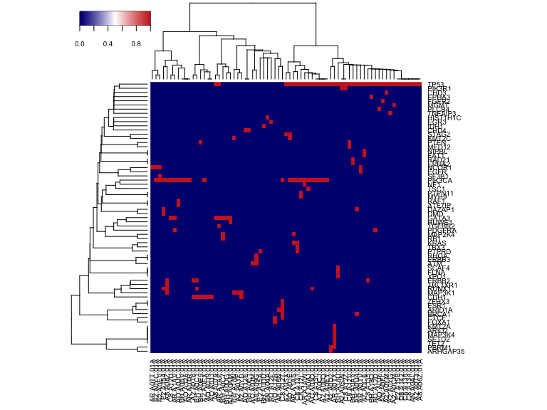

``` r
d <- as.dist(1 - cor((mutated), method = "spearman"))
clusters <- hclust(d,method ="ward.D2")
plot(clusters,cex=0.5)
```

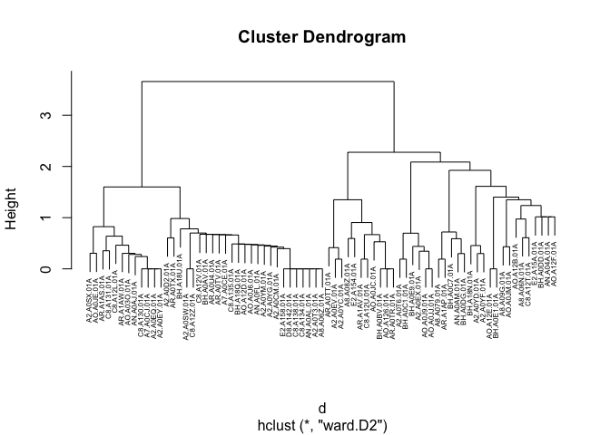

Unsprisingly, we can't get much out this heatmap the way it is. The best we can get is to just somewhat group them based on TP53 mutataions. In later analysis we will use subgroups of frequent mutations. For now, we will move on to investigate the expression data.

mRNA expression intitial inspection
-----------------------------------

Just inspecting the data distribution. We know that the data is normalized. So, there shouldn't be any problems here. Distributions should align. Just to verify.

``` r
plotDensities(expression, legend = F)
```

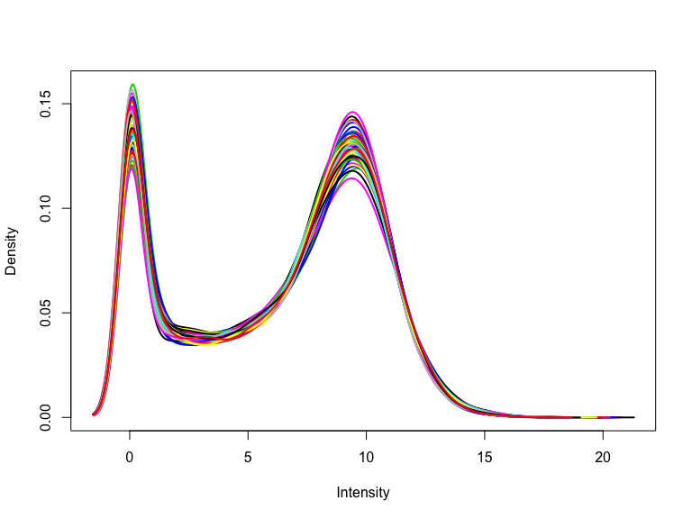

The distribution of mRNA expressions across different samples align and match.

``` r
boxplot(expression)
```

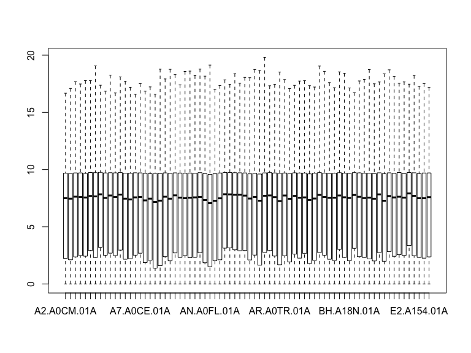

The boxplot also verifies the normalization of the samples as we see relative aligment between the variances and the means of expressions in each sample.

``` r
    plotMD(expression,column = 1)
    abline(h=0,col="red")
```

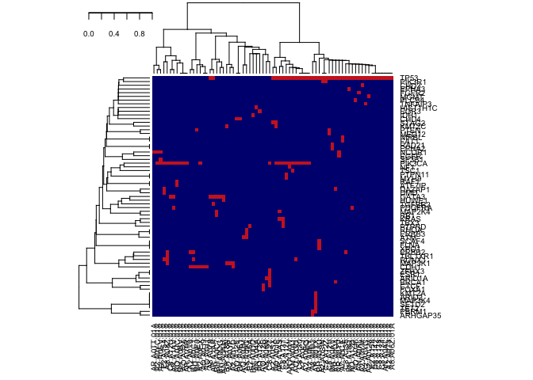

MD plot also shows the symmetry of differential expressions of one sample versus the others. The expression data does not need any further large scale normalization at this point.

``` r
    means  <- apply(expression, 1, mean)
    vars   <- apply(expression, 1, var)
    sds    <- apply(expression, 1, sd)
    plot(means,vars)
    abline(h=10,col="red")
```

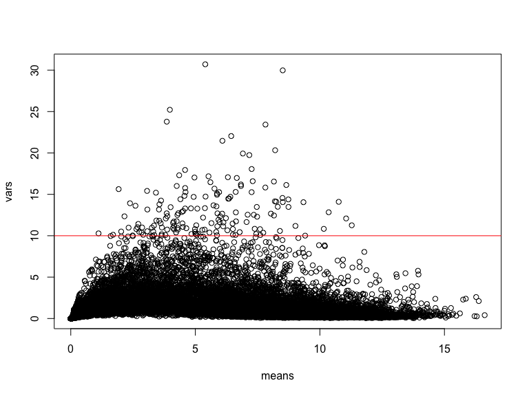

Just insepcting the relationship between variances and the means of expressions of the genes. We will later use this to select subsets of genes for differentially variable genes analysis. In particular, we will use variance thresholds. Though it is possible to use other metrics such as coefficient of variation. Variance seems to be a good choice because the data is already normalized and the variance alone is a good indicator of changes in individual gene levels.

``` r
    expression2 <- expression[vars !=0 & means !=0,]
    dim(expression)
```

    ## [1] 20502    74

``` r
    dim(expression2)
```

    ## [1] 19913    74

For the analysis we exclude the genes with zero mean and zero variance. We see some reduction becasue of zero variance genes.

``` r
   plotDensities(vars)
```

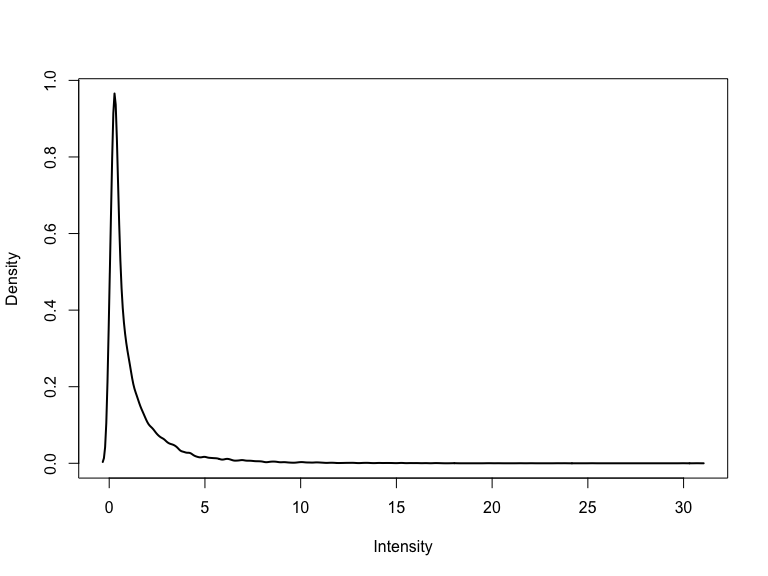

Somewhere in (2,3) the second derivative of the density plot/CDF of variance becomes positive.let's just pick that as the variance threshold. Let's do some preliminary analysis of mRNA Expressions. Let's just the bottom threshold for highly variable genes.

Protein data inspection
-----------------------

Moving on proteins. Just a prefiltering step on proteins. As we saw, proteins contains a number of missing points. While it's best to use some sort of imputation, I won't be doing that because I am unfamiliar with this data. Instead, I will just see if I can filter out the missing genes.

``` r
missings   <- apply(proteins, 1, function(X){
    sum(is.na(X))
})

sum(missings > 0)
```

    ## [1] 3628

There are 3628 proteins with missing values. For now lets say no proteins missing from the rest of the analysis. Though this assumption can be extended to some level missing.

``` r
proteins2   <- proteins
prot.means  <- apply(proteins2, 1, mean, na.rm =T)
prot.vars   <- apply(proteins2, 1, var,  na.rm =T)

sum(is.na(prot.means))
```

    ## [1] 0

``` r
proteins2  <- proteins[!(missings > 0),]
```

Just some data inspection. The normalization is described is the handout so we should be careful how to analyze and filter.

``` r
plot(prot.means,prot.vars)
```

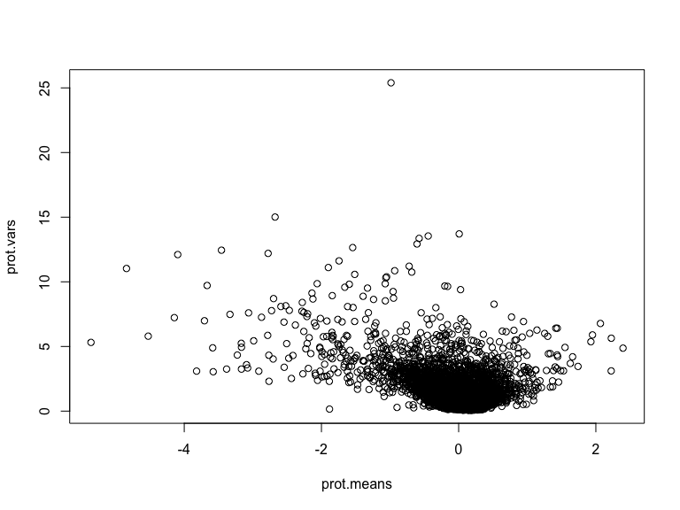

The only lession of this plot is that maybe filtering using variance is not the best choice. And that fits the nature of the data since every protein level is normalized by dividing on some baseline expression.

``` r
plotDensities(proteins2)
```

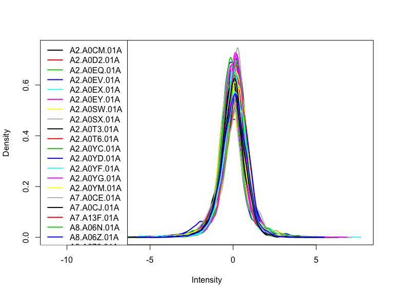

The density plot shows that even after filtering the proteins with missing values, we still see the original signal distributions to some extent. Each sample in the original data was Z-normalized. Even after filtering we see equal means across the samples in the plot. So the data does not become inconsistent as a result of filtering.

``` r
boxplot(proteins2)
```

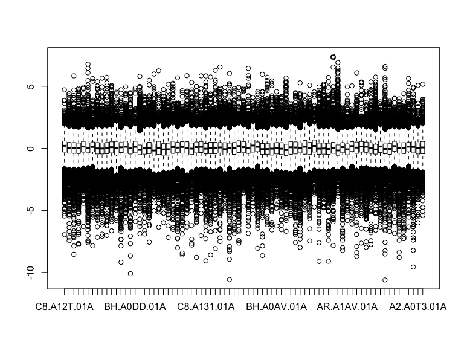

The boxplot also confirms that the data is not much affected in distribution after the filtering process. Means of the samples remain to be aligned close to zero and the size of the boxes are about the same.

``` r
plotMD(proteins2,column = 60)
abline(h=0,col="red")
```

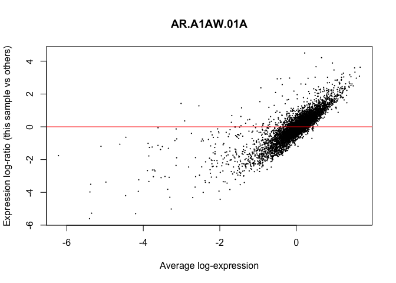

This is so much different from standard MA plot of expression. IDK for now what are the implications. Definitely no two-sample testing. Just as a hunch, let's just see what median polish does. Maybe we can get some further normalization.

``` r
prot.polish <- medpolish(proteins2, eps = 0.01, maxiter = 10,
                         trace.iter = TRUE,na.rm = F)
```

    ## 1: 313190
    ## Final: 312780.7

``` r
plotMD(prot.polish$residuals,column = 60)
```

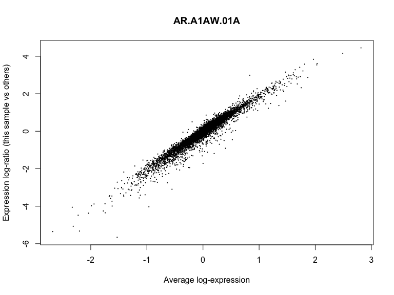

``` r
boxplot(prot.polish$residuals)
abline(h=0,col="red")
```

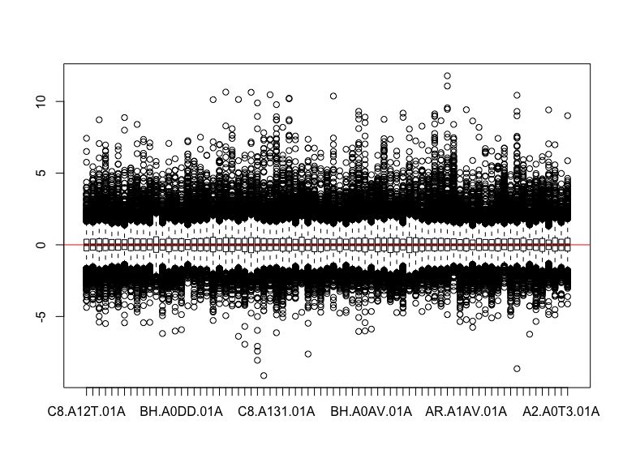

``` r
proteins3 <- prot.polish$residuals
```

Not surprinsingly median polish seems to smooth data. We get better MA plot, less noisy. We also get more aligned boxplots. However, I am not sure of the consequences and the indications of this process. So, I will investigate that some other day in the future. For now, I will just work with the original data.

Exploratory Analysis
====================

Data and library import
-----------------------

Here, I run an exploratory analysis to see what can be inferred from the data. For this, I will be using the processed data as it was explained before. Some more details can be found in the preprocessing code provided in the file `PreliminaryInsepction.R`.

``` r
rm(list = ls())
library(limma)
library(clusterProfiler)
library(org.Hs.eg.db)
library(CADIA)
library(dplyr)

# Parsing the cleaned Mutation, Expression, and Protein Data

mutated    <- readRDS("Data/mutationcleaned.rds")
expression <- readRDS("Data/mRNAcleaned.rds")
proteins2  <- readRDS("Data/protcleaned.rds")
```

Differentially variable genes
-----------------------------

As we discussed in the previous section, the range of (2,3) seems like a proper threshold for subsetting variable genes. Here, we select the lower bound to be as inclusive as possible in the analysis

``` r
vars        <- apply(expression, 1, var)
expression1 <- expression[vars > 0,]
expression2 <- expression[vars > 2,]
geneList    <- (rownames(expression1))
deGenes     <- (rownames(expression2))
```

For enrichment analysis, we create appropriate translation lists of variable genes.

``` r
set.seed(1)
gene.df    <- bitr(geneList, fromType = "SYMBOL",
                   toType = c("ENTREZID","ENSEMBL"),
                   OrgDb = org.Hs.eg.db)
deGenes.df <- bitr(deGenes, fromType = "SYMBOL",
                   toType = c("ENTREZID","ENSEMBL"),
                   OrgDb = org.Hs.eg.db)
```

GO enrichment analysis provides too many terms and does not necessarily give a clear picture of the underlying biological insight as it is. I have included the code chunk here for interested readers, but I will not run it because of the computational cost for the rendering of this document.

``` r
# enriched   <- enrichGO( gene           = deGenes.df$ENSEMBL,
#                          universe      = gene.df$ENSEMBL,
#                          OrgDb         = org.Hs.eg.db,
#                          keyType       = 'ENSEMBL',
#                          ont           = "BP",
#                          pAdjustMethod = "BH",
#                          pvalueCutoff  = 0.05,
#                          readable      = TRUE)
# #
#
# #
#  head(enriched,10)
#  ego <- gofilter(enriched,4)
#  head(ego)
```

Instead of GO enrichment analysis I use a enrichment analysis on KEGG pathways to get a more focused interpretations. For pathway analysis, I use my in-house methodology, CADIA.

``` r
##  network based analysis on KEGG pathways using CADIA
set.seed(1)
cadia.res  <- CADIA::causalDisturbance(deGenes.df$ENTREZID,gene.df$ENTREZID,
                                       iter = 5000)

cadia.res %<>% filter(.,cadia < 0.05) %>% select(., Name, KEGGID)
cadia.res
```

    ## # A tibble: 23 x 2
    ##    Name                                   KEGGID
    ##    <chr>                                  <chr> 
    ##  1 Cytokine-cytokine receptor interaction 04060 
    ##  2 ECM-receptor interaction               04512 
    ##  3 Chemical carcinogenesis                05204 
    ##  4 PI3K-Akt signaling pathway             04151 
    ##  5 Dilated cardiomyopathy                 05414 
    ##  6 Chemokine signaling pathway            04062 
    ##  7 Circadian entrainment                  04713 
    ##  8 cAMP signaling pathway                 04024 
    ##  9 Wnt signaling pathway                  04310 
    ## 10 Amphetamine addiction                  05031 
    ## # … with 13 more rows

CADIA uniquely identifies enrichment of a number of pathways including Wnt Signaling,and PI3K-Akt signaling pathway.

Moving on to proteins analysis. First, I will load a list of immune proteins. As downloaded form AmiGO.

``` r
    # Immunoproteins
imm.tab   <- read.csv("Data/immunoproteins",header = F, sep = "\t")
imm.prot  <- as.character(imm.tab$V2)
imm.prot2 <- intersect(imm.prot, rownames(proteins2))

imm.prots.all     <- bitr(imm.prot, fromType = "SYMBOL",
                        toType = c("ENTREZID","ENSEMBL"),
                        OrgDb = org.Hs.eg.db)
```

Aligning the two pieces of data using the immunoproteins.

``` r
mRNA.norm <- expression2[intersect(imm.prot2, rownames(expression2)),]
prot.norm <- proteins2[intersect(imm.prot2, rownames(expression2)),]

mRNA.norm <- mRNA.norm[,intersect(colnames(proteins2),
                                  colnames(expression2))]
prot.norm <- prot.norm[,intersect(colnames(proteins2),
                                  colnames(expression2))]
```

Correlation Analysis

``` r
prot.mRNA.cors <- sapply(1:nrow(mRNA.norm), function(X){
    cor(t(mRNA.norm[X,]),
        t(prot.norm[X,]),
        use='complete.obs')})


prot.mRNA.pvals <- sapply(1:nrow(mRNA.norm), function(X){
    zz <- cor.test(t(mRNA.norm[X,]),
                   t(prot.norm[X,]))
    return(zz$p.value)})


plotDensities(prot.mRNA.cors)
```

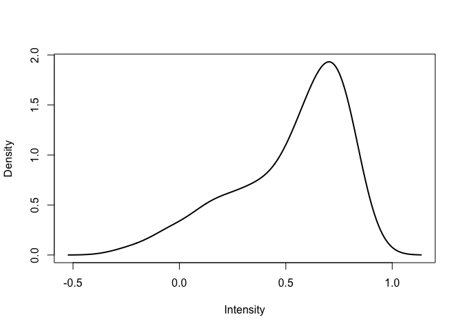

The correlation plot shows the distribution of correlation coefficients, most of which is positive. The negative ones are perhaps by random. So we will make sure we filter protein/mRNA associations that are not statistically supported by the correlation (FDR &lt; 0.005).

``` r
nrow(mRNA.norm)
```

    ## [1] 163

``` r
ncol(mRNA.norm)
```

    ## [1] 74

We have 163 mRNA and proteins signals are variable and consistent between the two datasets. This is acroos 74 samples. So let's put some quality criteria on the correlations.

``` r
prot.mRNA.fdr <- p.adjust(prot.mRNA.pvals)
plotDensities(prot.mRNA.cors[prot.mRNA.fdr < 0.005])
```

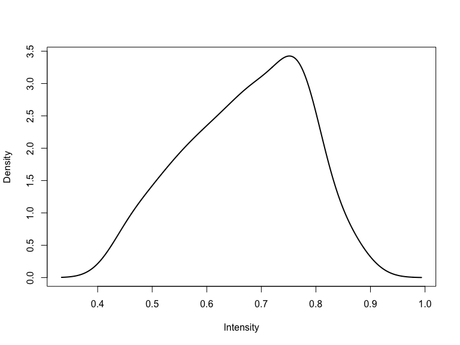

``` r
length(prot.mRNA.cors[prot.mRNA.fdr < 0.005])
```

    ## [1] 113

For 147 of the genes we have a consistent positive correlation Let's just work on these. We will also filter out the ones with correlations smaller than 0.4.

``` r
mRNA.filtered <- mRNA.norm[prot.mRNA.fdr < 0.005 & prot.mRNA.cors > 0.4,]
prot.filtered <- prot.norm[prot.mRNA.fdr < 0.005 & prot.mRNA.cors > 0.4,]
nrow(mRNA.filtered)
```

    ## [1] 113

Cluster analysis.
-----------------

It is interesting to find what suptypes exist in the data and what biological charachteristics they show. For this, I will start running model based clustering ysing Gaussian Mixture Models which well developed and implemented in the `mclust` package.

First, let's identify the number of different clusters using different prior assumptions for clustering. We evaluate the clustering quality and method using Bayesian Information Criterion (BIC).

``` r
library(mclust)

BIC <- mclustBIC(t(mRNA.filtered))
plot(BIC)
```

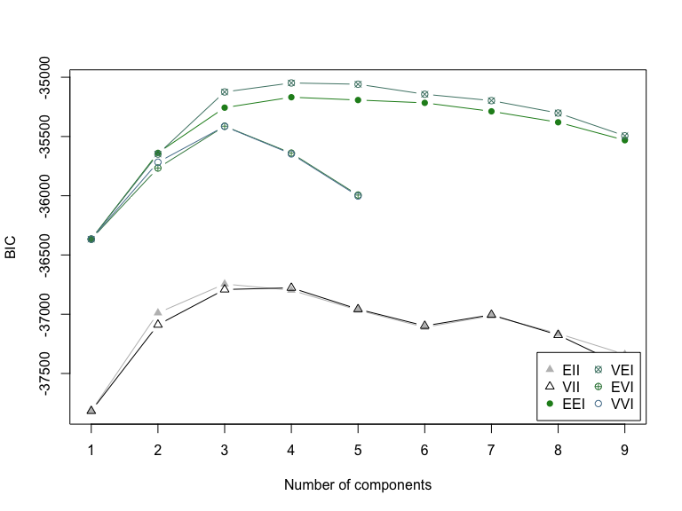

``` r
summary(BIC)
```

    ## Best BIC values:
    ##              VEI,4        VEI,5        VEI,3
    ## BIC      -35048.16 -35058.82504 -35124.08270
    ## BIC diff      0.00    -10.66901    -75.92666

``` r
BIC <- mclustBIC(t(prot.filtered))
plot(BIC)
```

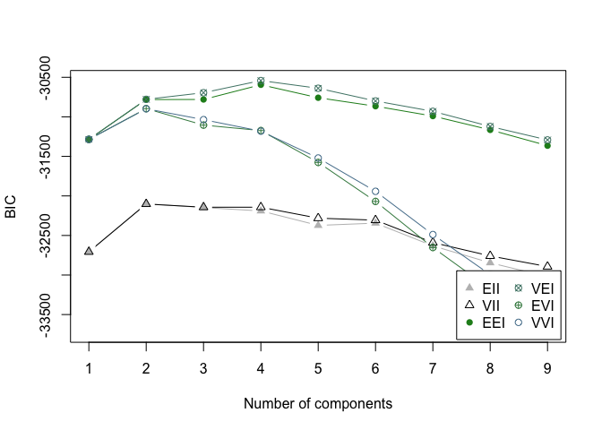

``` r
summary(BIC)
```

    ## Best BIC values:
    ##              VEI,4        EEI,4        VEI,5
    ## BIC      -30541.66 -30594.40178 -30638.87153
    ## BIC diff      0.00    -52.73847    -97.20821

The best model for mRNA data according to BIC is four cluster with "VEI" model.

``` r
library(mclust)


BIC <- mclustBIC(t(prot.filtered))
plot(BIC)
```

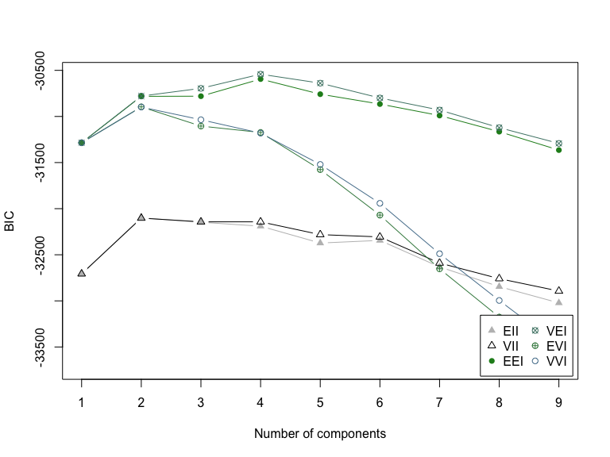

``` r
summary(BIC)
```

    ## Best BIC values:
    ##              VEI,4        EEI,4        VEI,5
    ## BIC      -30541.66 -30594.40178 -30638.87153
    ## BIC diff      0.00    -52.73847    -97.20821

The best model for protein data according to BIC is four cluster with "VEI" model.

Now we use this information to classify the samples.

``` r
mod.mRNA <- Mclust(t(mRNA.filtered), G = 4, modelName = "VEI")
mod.prot <- Mclust(t(prot.filtered), G = 4, modelName = "VEI")
```

Moving on to visualization. We also classify the mRNA expressions according to agglomerative clustering.

``` r
library(RColorBrewer)

clust.order <- unlist(tapply(1:ncol((mRNA.filtered)),
                             as.factor(mod.mRNA$classification),I)
                      ,use.names = F)
mRNA.mat    <- data.matrix(mRNA.filtered)[,clust.order]


# Just some color setting for visualization
        
        my_group    <- as.numeric(as.factor(mod.mRNA$classification))
        my_col1     <- brewer.pal(8, "Set1")[my_group]
        my_col1     <- my_col1[clust.order]
        
        my_group    <- as.numeric(as.factor(mod.prot$classification))
        my_col2     <- brewer.pal(8, "Set2")[my_group]
        my_col2     <- my_col2[clust.order]
        
        coul        <- colorRampPalette(brewer.pal(10, "RdBu"))(50)
        my_col      <- cbind("mRNA"= my_col1, "Protein" = my_col2)


# Distance based clustering 
        
d  <- dist( data.matrix(mRNA.filtered ), method = "euclidian")
hc <- hclust(d,method = "complete")

plot(hc,labels=rownames(mRNA.filtered),cex=0.5)
```

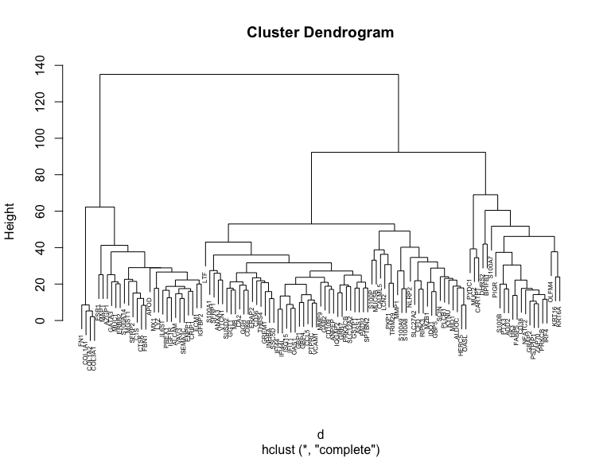

Three clusteris is a suitable choice for row vectors (expressions) so lets just do the rest of coloring and heatmap.

``` r
    hclusters  <- cutree(hc, h=80)
    row.order  <- unlist(tapply(1:nrow((mRNA.filtered)),
                                 as.factor(hclusters),I),use.names = F)
    
    mRNA.mat   <- mRNA.mat[row.order,]
    
    my_group   <- as.numeric(as.factor(hclusters))
    my_col1    <- brewer.pal(9, "Set1")[my_group]
    my_row_col <- brewer.pal(9, "Set1")[my_group]
    my_row_col <- my_row_col[row.order]

heatmap3(mRNA.mat,Colv = NA,Rowv = NA,showColDendro = F,showRowDendro = F,
          scale = "none", col = coul,RowSideColors =  my_row_col,
          ColSideColors=my_col)
```

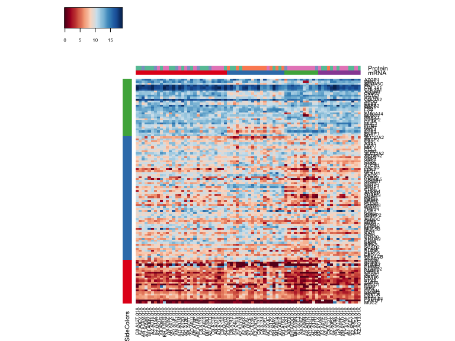

Interpreting the cluster functions

``` r
clust1 <- names(hclusters[hclusters ==1])
clust2 <- names(hclusters[hclusters ==2])
clust3 <- names(hclusters[hclusters ==3])

gene.clust1     <- bitr(clust1, fromType = "SYMBOL",
                        toType = c("ENTREZID","ENSEMBL"),
                        OrgDb = org.Hs.eg.db)
gene.clust2     <- bitr(clust2, fromType = "SYMBOL",
                        toType = c("ENTREZID","ENSEMBL"),
                        OrgDb = org.Hs.eg.db)
gene.clust3     <- bitr(clust3, fromType = "SYMBOL",
                        toType = c("ENTREZID","ENSEMBL"),
                        OrgDb = org.Hs.eg.db)


set.seed(1)
cadia.res1  <- CADIA::causalDisturbance(gene.clust1$ENTREZID,
                                        imm.prots.all$ENTREZID,
                                       iter = 5000)
set.seed(1)
cadia.res2  <- CADIA::causalDisturbance(gene.clust2$ENTREZID,
                                        imm.prots.all$ENTREZID,
                                       iter = 5000)
set.seed(1)
cadia.res3  <- CADIA::causalDisturbance(gene.clust3$ENTREZID,
                                        imm.prots.all$ENTREZID,
                                       iter = 5000)

head(cadia.res1,5)
```

    ## # A tibble: 5 x 10
    ##   Name  nodes edges   P_ORA `No. DE`  P_SSC `causal Disturb… cadia ORAFDR
    ##   <chr> <fct> <fct>   <dbl> <fct>     <dbl>            <dbl> <dbl>  <dbl>
    ## 1 T ce… 105   216   0.0127  3        0.0164          0.00197 0.281  0.599
    ## 2 Th17… 107   200   0.0157  3        0.097           0.0114  0.544  0.599
    ## 3 Oxyt… 159   462   0.00314 3        0.451           0.0107  0.544  0.449
    ## 4 Natu… 135   370   0.0284  3        0.131           0.0246  0.879  0.678
    ## 5 Ras … 229   1396  0.111   2        0.999           0.355   1      0.687
    ## # … with 1 more variable: KEGGID <chr>

``` r
head(cadia.res2,5)
```

    ## # A tibble: 5 x 10
    ##   Name  nodes edges  P_ORA `No. DE`  P_SSC `causal Disturb… cadia ORAFDR
    ##   <chr> <fct> <fct>  <dbl> <fct>     <dbl>            <dbl> <dbl>  <dbl>
    ## 1 Wnt … 143   814   0.0749 3        0.0838          0.0381  0.256  0.369
    ## 2 Calc… 182   524   0.0528 3        0.0094          0.00427 0.256  0.343
    ## 3 Phos… 144   419   0.259  2        0.0132          0.0228  0.256  0.726
    ## 4 cAMP… 200   674   0.378  2        0.011           0.0270  0.256  0.907
    ## 5 Gap … 88    227   0.0862 2        0.0566          0.0308  0.256  0.385
    ## # … with 1 more variable: KEGGID <chr>

``` r
head(cadia.res3,5)
```

    ## # A tibble: 5 x 10
    ##   Name  nodes edges   P_ORA `No. DE`  P_SSC `causal Disturb…  cadia ORAFDR
    ##   <chr> <fct> <fct>   <dbl> <fct>     <dbl>            <dbl>  <dbl>  <dbl>
    ## 1 Foca… 201   1854  7.25e-5 6        0.197          0.000174 0.0248 0.0104
    ## 2 Endo… 98    304   6.56e-3 3        0.015          0.00101  0.0720 0.183 
    ## 3 ECM-… 82    521   1.04e-3 3        0.346          0.00322  0.154  0.0728
    ## 4 PI3K… 341   2677  1.79e-2 4        0.0888         0.0118   0.242  0.320 
    ## 5 Pros… 89    294   5.52e-2 2        0.0244         0.0102   0.242  0.607 
    ## # … with 1 more variable: KEGGID <chr>

The three genes cluster repsent different functionalities. Cluster 1 is associated with T cell receptor pathway and Th17 cell differentiation. Cluster 2 is associated with several signaling pathways including Wnt, Calcium, Phospolipase D, cAMP. Cluster 3 is associated with Focal adhesion. Endocrine resistance, ECM-receptor interaction

A similar analysis on the protein data identifies two row clusters for proteins levels. The larger cluster associates with several pathways including Wnt signaling. For space limitations, we only provide the end image here. Interested readers may investigate the code `ModelBasedProtCluster.R`.


<p class="caption">
Clustering of Protein Levels and Samples
</p>

Running WGCNA Analysis
----------------------

Just to take an sligthly alternative approach, we use `WGNCA` library to determing the clusters in the correlation network of the mRNA/protein expression. The file `WGCNArunner.R` contains the functions that find the optimal values for the analysis and report the resutls. In this case, I only show the analysis for Protein data. For mRNA data, I will provide the results and the code is accessible via `WGCNAModeling.R`.

I used WGCNA to cluster the rows, and for column clusters, I used the resutls of model-based clustering from `mclust`. Same applies to both protein and mRNA data.

``` r
rm(list= ls())
library(WGCNA)
library(CADIA)
library(heatmap3)
library(mclust)
library(RColorBrewer)


prot.filtered <- readRDS("Data/protfiltered.rds")
mRNA.filtered <- readRDS("Data/mRNAfiltered.rds")

mod.prot      <- readRDS("Data/modprot.rds")
mod.mRNA      <- readRDS("Data/modmRNA.rds")
imm.prots.all <- readRDS("Data/immprotsall.rds")


source("WGCNArunner.R")

### For protein data 
dynamicColors <- wgcna.reporter(prot.filtered,"prot")
coul          <- colorRampPalette(brewer.pal(10, "RdBu"))(50)
module.order  <- unlist(tapply(1:ncol(t(prot.filtered)),
                               as.factor(dynamicColors),I))


m <- t(prot.filtered)[,module.order]

dynamic.col.color <- brewer.pal(4, "Set1")[mod.prot$classification]
col.order         <- unlist(tapply(1:ncol((prot.filtered)),    
                                   as.factor(dynamic.col.color),I))

m <- m[col.order,]


heatmap3(t(m),col=coul,Rowv=NA,Colv=NA,scale=c("none"),
         RowSideColors=dynamicColors[module.order],
         ColSideColors=dynamic.col.color[col.order],
         ColSideLabs = "Sample Clusters",
         RowSideLabs = "Proteins Clusters")
```

Running CADIA to infer the associated pathways with the WGCNA modules.

``` r
prot.res <- rownames(prot.filtered)
dynaCos  <- as.character(dynamicColors)
clust1   <- (prot.res[dynaCos == "grey" ])
clust2   <- (prot.res[dynaCos == "turquoise"])
clust3   <- (prot.res[dynaCos == "blue"])

gene.clust1     <- bitr(clust1, fromType = "SYMBOL",
                        toType = c("ENTREZID","ENSEMBL"),
                        OrgDb = org.Hs.eg.db)
gene.clust2     <- bitr(clust2, fromType = "SYMBOL",
                        toType = c("ENTREZID","ENSEMBL"),
                        OrgDb = org.Hs.eg.db)
gene.clust3     <- bitr(clust3, fromType = "SYMBOL",
                        toType = c("ENTREZID","ENSEMBL"),
                        OrgDb = org.Hs.eg.db)


set.seed(1)
cadia.res1  <- CADIA::causalDisturbance(gene.clust1$ENTREZID,imm.prots.all$ENTREZID,
                                        iter = 5000)
cadia.res1
```

    ## # A tibble: 143 x 10
    ##    Name  nodes edges   P_ORA `No. DE`  P_SSC `causal Disturb…  cadia ORAFDR
    ##    <chr> <fct> <fct>   <dbl> <fct>     <dbl>            <dbl>  <dbl>  <dbl>
    ##  1 ECM-… 82    521   7.95e-5 5        0.589          0.000514 0.0734 0.0114
    ##  2 Calc… 182   524   7.10e-3 4        0.0306         0.00205  0.104  0.127 
    ##  3 Gast… 75    111   3.89e-4 4        0.601          0.00219  0.104  0.0278
    ##  4 Foca… 201   1854  6.10e-3 6        0.258          0.0117   0.162  0.125 
    ##  5 Plat… 122   321   1.83e-3 5        0.829          0.0114   0.162  0.0873
    ##  6 Insu… 85    99    7.31e-2 2        0.024          0.0129   0.162  0.290 
    ##  7 GnRH… 92    235   3.71e-2 3        0.0504         0.0136   0.162  0.208 
    ##  8 Reni… 65    69    5.23e-3 3        0.305          0.0119   0.162  0.125 
    ##  9 Dopa… 130   599   1.30e-2 3        0.051          0.00553  0.162  0.155 
    ## 10 Olfa… 419   4238  1.73e-2 2        0.0494         0.00690  0.162  0.177 
    ## # … with 133 more rows, and 1 more variable: KEGGID <chr>

``` r
set.seed(1)
cadia.res2  <- CADIA::causalDisturbance(gene.clust2$ENTREZID,imm.prots.all$ENTREZID,
                                        iter = 5000)
cadia.res1
```

    ## # A tibble: 143 x 10
    ##    Name  nodes edges   P_ORA `No. DE`  P_SSC `causal Disturb…  cadia ORAFDR
    ##    <chr> <fct> <fct>   <dbl> <fct>     <dbl>            <dbl>  <dbl>  <dbl>
    ##  1 ECM-… 82    521   7.95e-5 5        0.589          0.000514 0.0734 0.0114
    ##  2 Calc… 182   524   7.10e-3 4        0.0306         0.00205  0.104  0.127 
    ##  3 Gast… 75    111   3.89e-4 4        0.601          0.00219  0.104  0.0278
    ##  4 Foca… 201   1854  6.10e-3 6        0.258          0.0117   0.162  0.125 
    ##  5 Plat… 122   321   1.83e-3 5        0.829          0.0114   0.162  0.0873
    ##  6 Insu… 85    99    7.31e-2 2        0.024          0.0129   0.162  0.290 
    ##  7 GnRH… 92    235   3.71e-2 3        0.0504         0.0136   0.162  0.208 
    ##  8 Reni… 65    69    5.23e-3 3        0.305          0.0119   0.162  0.125 
    ##  9 Dopa… 130   599   1.30e-2 3        0.051          0.00553  0.162  0.155 
    ## 10 Olfa… 419   4238  1.73e-2 2        0.0494         0.00690  0.162  0.177 
    ## # … with 133 more rows, and 1 more variable: KEGGID <chr>

``` r
set.seed(1)
cadia.res3  <- CADIA::causalDisturbance(gene.clust3$ENTREZID,imm.prots.all$ENTREZID,
                                        iter = 5000)
cadia.res1
```

    ## # A tibble: 143 x 10
    ##    Name  nodes edges   P_ORA `No. DE`  P_SSC `causal Disturb…  cadia ORAFDR
    ##    <chr> <fct> <fct>   <dbl> <fct>     <dbl>            <dbl>  <dbl>  <dbl>
    ##  1 ECM-… 82    521   7.95e-5 5        0.589          0.000514 0.0734 0.0114
    ##  2 Calc… 182   524   7.10e-3 4        0.0306         0.00205  0.104  0.127 
    ##  3 Gast… 75    111   3.89e-4 4        0.601          0.00219  0.104  0.0278
    ##  4 Foca… 201   1854  6.10e-3 6        0.258          0.0117   0.162  0.125 
    ##  5 Plat… 122   321   1.83e-3 5        0.829          0.0114   0.162  0.0873
    ##  6 Insu… 85    99    7.31e-2 2        0.024          0.0129   0.162  0.290 
    ##  7 GnRH… 92    235   3.71e-2 3        0.0504         0.0136   0.162  0.208 
    ##  8 Reni… 65    69    5.23e-3 3        0.305          0.0119   0.162  0.125 
    ##  9 Dopa… 130   599   1.30e-2 3        0.051          0.00553  0.162  0.155 
    ## 10 Olfa… 419   4238  1.73e-2 2        0.0494         0.00690  0.162  0.177 
    ## # … with 133 more rows, and 1 more variable: KEGGID <chr>

The three genes cluster repsent different functionalities.Cluster 1 (Grey) is associated with ECM Receptor interactions. Cluster 2's (turquoise) associations are weak. Cluster 3 (Blue) is associated with NOD-like receptor signaling,T cell receptor.

Similarly, if we run WGCNA on the mRNA data, we get the following heatmap.


<p class="caption">
Clustering of Protein Levels and Samples
</p>

In the above map, the rows represent mRNA expressions and the clusters associations are as following. Cluster 1 (Grey)is associated with ECM Receptor interactions. Cluster 2's associations are weak and unindentifiable (turquoise). Cluster 3 (Blue) is associated with NOD-like receptor signaling,T cell receptor. Cluster 4 (brown) ECM-Receptor interaction and focal adhesion.

Principal Component Analysis
----------------------------

It would be interesting to investigate the quality of model based clustering to see how different and separated are the predicted subtypes. So, let's do some dimentionality reduction and visualizations.

``` r
##  PCA on mRNA data
    mRNA.pca <- prcomp(t(mRNA.filtered), center = TRUE, scale. = TRUE)
    plot(mRNA.pca,type = "l")
```

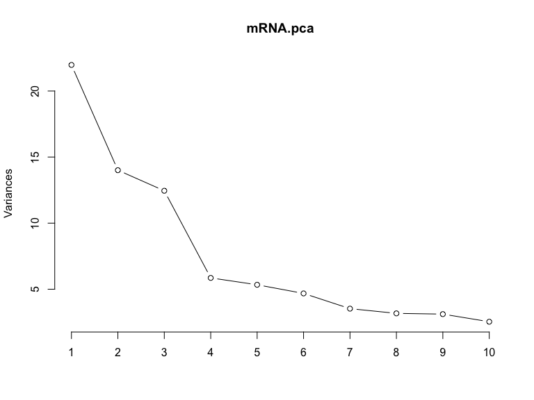

``` r
# The plot tells us after the 4th PC we can't get much  variance explained

#  mRNA.sum <- mRNA.pca$x[,1:4]
# Let's work on 4 PCs
        
library(ggbiplot)
```

    ## Loading required package: ggplot2

    ## Loading required package: plyr

    ## -------------------------------------------------------------------------

    ## You have loaded plyr after dplyr - this is likely to cause problems.
    ## If you need functions from both plyr and dplyr, please load plyr first, then dplyr:
    ## library(plyr); library(dplyr)

    ## -------------------------------------------------------------------------

    ## 
    ## Attaching package: 'plyr'

    ## The following objects are masked from 'package:dplyr':
    ## 
    ##     arrange, count, desc, failwith, id, mutate, rename, summarise,
    ##     summarize

    ## The following object is masked from 'package:IRanges':
    ## 
    ##     desc

    ## The following object is masked from 'package:S4Vectors':
    ## 
    ##     rename

    ## Loading required package: scales

    ## Loading required package: grid

``` r
    set.seed(1)
    ggbiplot(mRNA.pca , obs.scale = 1, var.scale =1 , var.axes = F,
                  ellipse = T,groups = as.factor(mod.mRNA$classification))+
        geom_point(aes( color =  as.factor(mod.mRNA$classification)),size = 3) +
        theme_bw()
```

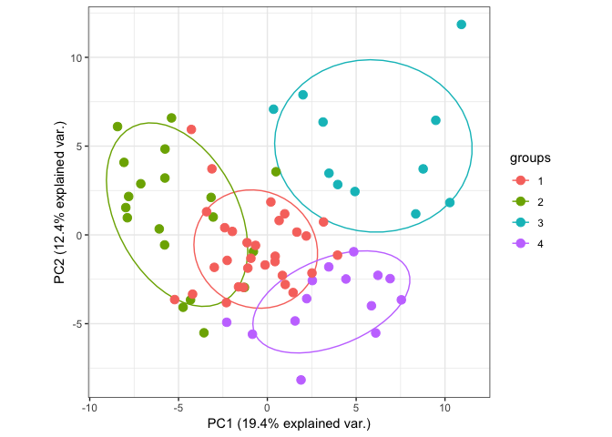

``` r
##  PCA on prot data
prot.pca <- prcomp(t(prot.filtered), center = TRUE, scale. = TRUE)
plot(prot.pca,type = "l")
```

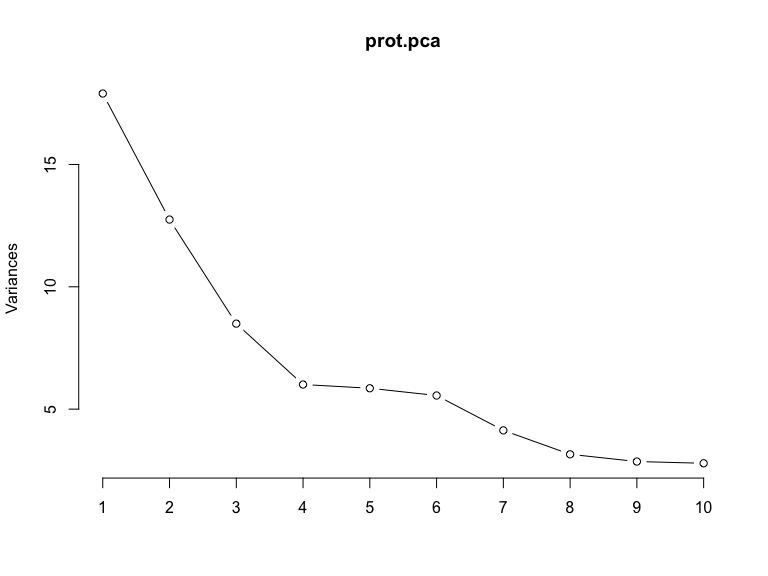

``` r
# Similar to mRNA, the elbow happens arond 4th PC
# after the 4th PC we can't get much  variance explained

# prot.sum <- prot.pca$x[,1:4]
# Let's work on 4 PCs

set.seed(1)
ggbiplot(prot.pca , obs.scale = 1, var.scale =1 , var.axes = F,
              ellipse = T,groups = as.factor(mod.prot$classification))+
    geom_point(aes( color =  as.factor(mod.prot$classification))
               ,size = 3) +
    theme_bw()
```

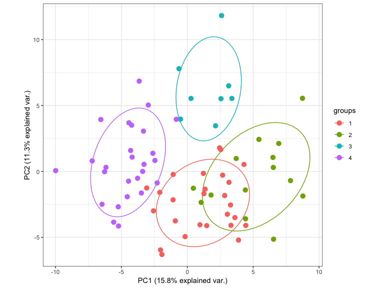

The elbow methods tell us that 4 of the Principal Components should be informative enough for future applications. The separation of the samples by the predicted classes of the model based clustering seems acceptable even though we are only using two dimensions. In fact, it turns out that if we use a 3D visualizations the separation between the classes, even when applying the mRNA-dervied classes to the protein data, becomes clear. The following is the code for that. However, it is commented to the report document can be rendered.

``` r
#library("pca3d")
    
 #   pca3d(mRNA.pca,group = mod.mRNA$classification)
 #   pca3d(prot.pca,group = mod.mRNA$classification)
```

TP53 Analysis
=============

In the first part we showed that our best initial guess for supgroups in the mutation data is to go with the TP53 mutations. So here, we run a differential expression analysis based on contrasting the samples that have TP53 mutations versus the ones without TP53 mutations.

``` r
rm(list = ls())
library(limma)

# Parsing and inspecting the Mutation Data

mutated     <- readRDS("Data/mutationcleaned.rds")
p53.mutated <- names(which(mutated["TP53",] == 1))
no.53       <- names(which(mutated["TP53",] == 0))


proteins    <- readRDS("Data/protcleaned.rds")
expression  <- readRDS("Data/mRNAcleaned.rds")
expression  <- expression[,intersect(colnames(expression),
                                     colnames(mutated))]


types <- rep("No_53",ncol(expression))
types[colnames(expression) %in%
          names(which(mutated["TP53",] == 1))] <- "TP53"

# Some filtering
means <- apply(expression, 1, mean)
vars   <- apply(expression, 1, var)
expression2 <- expression[vars !=0,]
dim(expression2)
```

    ## [1] 19905    70

Now we set-up differential expression analysis using the `limma` package. Since the data is already log-normalized, 1-way ANOVA would be useful and appropriate.

``` r
sml <- c()

sml     <- types
fl      <- as.factor(sml)

design  <- model.matrix(~ fl + 0, expression2)
colnames(design) <- levels(fl)
fit     <- lmFit(expression2, design)
cont.matrix <- makeContrasts(TP53-No_53, levels=design)
fit2    <- contrasts.fit(fit, cont.matrix)
fit2    <- eBayes(fit2, 0.01)
tT      <- topTable(fit2, adjust="fdr", sort.by="B", number=Inf)

head(tT)
```

    ##              logFC   AveExpr         t      P.Value    adj.P.Val         B
    ## PCDH19  -1.9876272  5.678565 -6.702615 4.351227e-09 8.661117e-05 10.493276
    ## GSDMC    2.6933576  4.521862  6.464369 1.169972e-08 8.710163e-05  9.573118
    ## RPS27L  -0.7755628  9.650372 -6.406503 1.486043e-08 8.710163e-05  9.350620
    ## TMSB15A  2.6791609  4.907325  6.366827 1.750347e-08 8.710163e-05  9.198309
    ## WHAMMP3 -1.0721104  5.136621 -6.156018 4.160355e-08 1.602656e-04  8.392736
    ## MORC2    0.6110922 10.395586  6.105531 5.113506e-08 1.602656e-04  8.200806

``` r
tT.deGenes <- tT[tT$adj.P.Val < 0.005, ]
tT.deGenes <- tT.deGenes[abs(tT.deGenes$logFC) >1,]

nrow(tT.deGenes)
```

    ## [1] 308

Our criteria for differential expression analysis is adjusted p-value of difference being less than 0.005 and fold-change magnitude greater than 1. I used Benjamini-Hochberg method for adjusting the p-values. This produces 308 DEG associated with TP53 mutation. Now we move on with enrichment analysis of the differential expressions.

``` r
geneList <- (rownames(tT))
deGenes  <- (rownames(tT.deGenes))


gene.df    <- bitr(geneList, fromType = "SYMBOL",
                    toType = c("ENTREZID","ENSEMBL"),
                    OrgDb = org.Hs.eg.db)
deGenes.df <- bitr(deGenes, fromType = "SYMBOL",
                   toType = c("ENTREZID","ENSEMBL"),
                   OrgDb = org.Hs.eg.db)


set.seed(1)
cadia.res  <- CADIA::causalDisturbance(deGenes.df$ENTREZID,gene.df$ENTREZID  
                                       ,iter = 5000)

head(cadia.res)
```

    ## # A tibble: 6 x 10
    ##   Name  nodes edges   P_ORA `No. DE` P_SSC `causal Disturb…  cadia  ORAFDR
    ##   <chr> <fct> <fct>   <dbl> <fct>    <dbl>            <dbl>  <dbl>   <dbl>
    ## 1 Oocy… 124   424   1.10e-5 10       0.500        0.0000721 0.0103 0.00157
    ## 2 Micr… 299   518   8.82e-5 10       0.583        0.000559  0.0400 0.00630
    ## 3 Th1 … 92    256   3.28e-1 2        0.001        0.00296   0.0762 0.902  
    ## 4 Prog… 98    150   4.76e-4 7        0.484        0.00216   0.0762 0.0136 
    ## 5 Adre… 149   877   4.33e-4 9        0.827        0.00320   0.0762 0.0136 
    ## 6 Pros… 89    294   3.39e-4 7        0.896        0.00276   0.0762 0.0136 
    ## # … with 1 more variable: KEGGID <chr>

The pathway analysis at this point show assosiciation of some pathways at the confidence level of FDR &lt;0.1 such as Th1 and Th2 cell differentiation and MicroRNAs in cancer.

Let's investigate the results of differential expressions through protein analysis. For this, I also load the list of immunoproteins and cytokines that were retrieved using AmiGO queries.

``` r
proteins2  <- readRDS("Data/protcleaned.rds")

# Loading cytokines and immune proteins

imm.tab   <- read.csv("Data/immunoproteins",header = F, sep = "\t")
imm.prot  <- as.character(imm.tab$V2)
imm.prot2 <- intersect(imm.prot, rownames(proteins2)) 

cyt.tab  <- read.csv("Data/cytokines",header = F, sep = "\t")
cyt.prot <- as.character(cyt.tab$V2)
cyt.imm  <- union(cyt.prot,imm.prot)    
cyt.imm2 <- intersect(cyt.imm, rownames(proteins2))  
```

Here, I will be aligning the datasets to have the same samples, and limit them to only cytokines and immunoproteins.

``` r
mRNA.norm <- expression2[intersect(cyt.imm2, rownames(tT.deGenes)),]
prot.norm <- proteins2[intersect(cyt.imm2, rownames(tT.deGenes)),]

mRNA.norm <- mRNA.norm[,intersect(colnames(proteins2), 
                                  colnames(expression2))]
prot.norm <- prot.norm[,intersect(colnames(proteins2),
                                  colnames(expression2))]


prot.mRNA.cors <- sapply(1:nrow(mRNA.norm), function(X){
    cor(t(mRNA.norm[X,]),
        t(prot.norm[X,]),
        use='complete.obs')})


prot.mRNA.pvals <- sapply(1:nrow(mRNA.norm), function(X){
    zz <- cor.test(t(mRNA.norm[X,]),
                   t(prot.norm[X,]))
    return(zz$p.value)})

prot.mRNA.fdr <- p.adjust(prot.mRNA.pvals)
length(prot.mRNA.cors[prot.mRNA.fdr < 0.05])
```

    ## [1] 17

``` r
mRNA.fitlered <- mRNA.norm[prot.mRNA.fdr < 0.05,]
prot.fitlered <- prot.norm[prot.mRNA.fdr < 0.05,]
```

I will only use those genes and proteins whose respective values correlate with each other (FDR &lt;0.05, n =17).

Just a quick model based clustering. Again, the number of clusters and the models are determined using BIC. For both of proteins and mRNAs data we have 3 clusters is the optimal. I also cluster the row values corresponding to proteins/mRNAs using distance based clustering.

``` r
library(mclust)


mod.mRNA <- Mclust(t(mRNA.fitlered), G = 3, modelName = "VEI")
mod.prot <- Mclust(t(prot.fitlered), G = 3, modelName = "VEI")


library(RColorBrewer)


clust.order <- unlist(tapply(1:ncol((mRNA.fitlered)),
                             as.factor(mod.mRNA$classification),I)
                      ,use.names = F)
mRNA.mat    <- data.matrix(mRNA.fitlered)[,clust.order]


# Just some color setting for visualization

my_group    <- as.numeric(as.factor(mod.mRNA$classification))
my_col1     <- brewer.pal(8, "Set1")[my_group]
my_col1     <- my_col1[clust.order]

my_group    <- as.numeric(as.factor(mod.prot$classification))
my_col2     <- brewer.pal(8, "Set2")[my_group]
my_col2     <- my_col2[clust.order]

coul        <- colorRampPalette(brewer.pal(10, "RdBu"))(50)
my_col      <- cbind("mRNA"= my_col1, "Protein" = my_col2)


# Distance based clustering 

d  <- dist( data.matrix(mRNA.fitlered ), method = "euclidian")
hc <- hclust(d,method = "complete")

plot(hc,labels=rownames(mRNA.fitlered),cex=0.5)
```

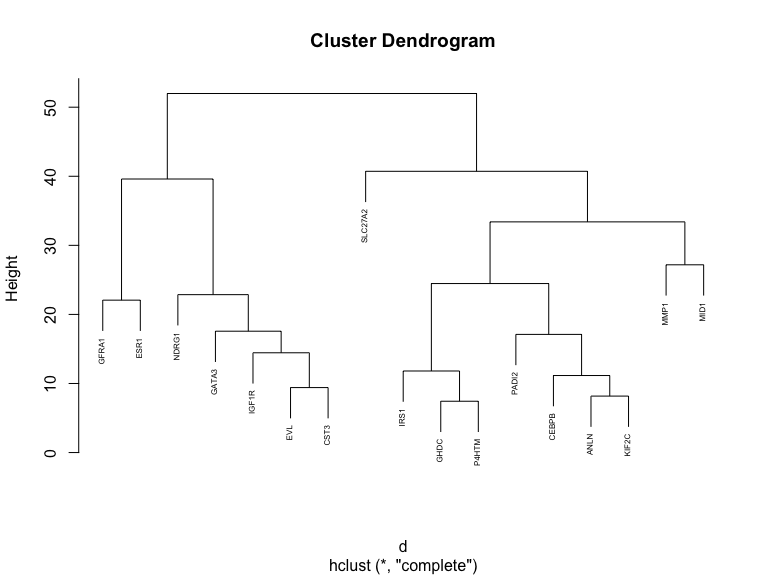

``` r
# Three seems suitable so lets just do the rest of coloring and heatmap   
hclusters  <- cutree(hc, h=45)
row.order  <- unlist(tapply(1:nrow((mRNA.fitlered)),
                            as.factor(hclusters),I),use.names = F)

mRNA.mat   <- mRNA.mat[row.order,]

my_group   <- as.numeric(as.factor(hclusters))
my_col1    <- brewer.pal(9, "Set1")[my_group]
my_row_col <- brewer.pal(9, "Set1")[my_group]
my_row_col <- my_row_col[row.order]

heatmap3(mRNA.mat,Colv = NA,Rowv = NA,showColDendro = F,showRowDendro = F,
         scale = "none", col = coul,RowSideColors =  my_row_col,
         ColSideColors=my_col)
```

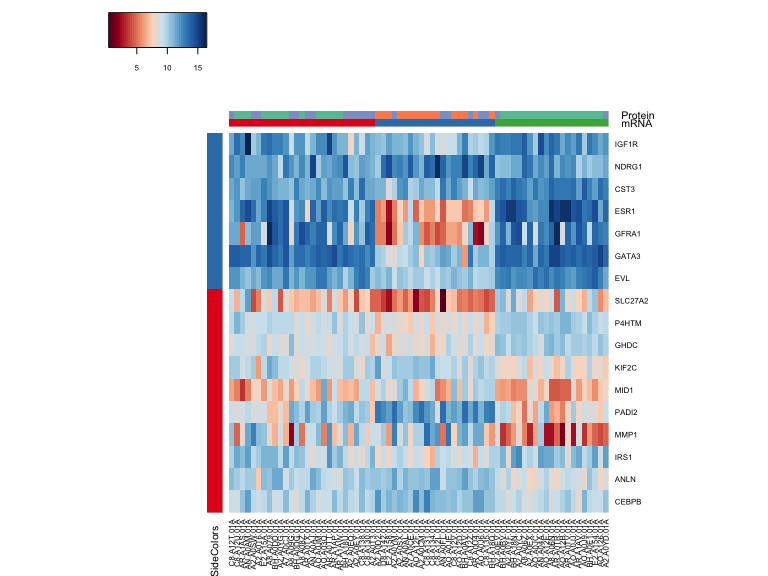

In the three clusters of the samples, there is strong confirmation between clusters 2 of proteins and 2 of mRNAs.

Now, some PCA plots just to check where any patterns of mutations are observable in the samples.

``` r
seq.pca <- prcomp(t(mRNA.fitlered), center = TRUE, scale. = TRUE)
plot(seq.pca,type = "l")
```

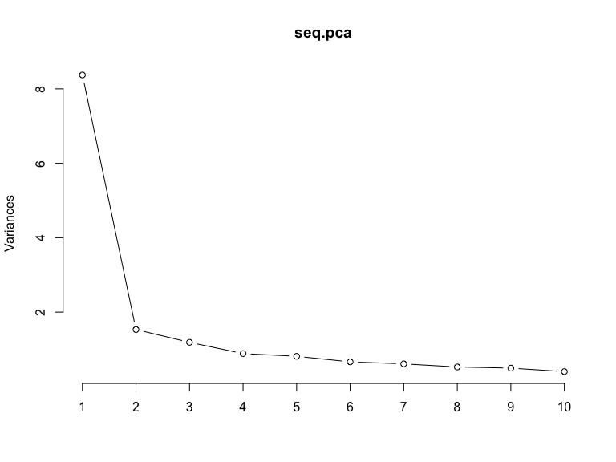

``` r
scoreTot <- seq.pca$x[,1:4]
# Let's work on 4 PCs


library(ggbiplot)
set.seed(1)
 ggbiplot(seq.pca , obs.scale = 1, var.scale =1 , var.axes = F,
              ellipse = T,groups = as.factor(mod.mRNA$classification))+
    geom_point(aes(shape = types ), size = 3) + theme_bw()
```

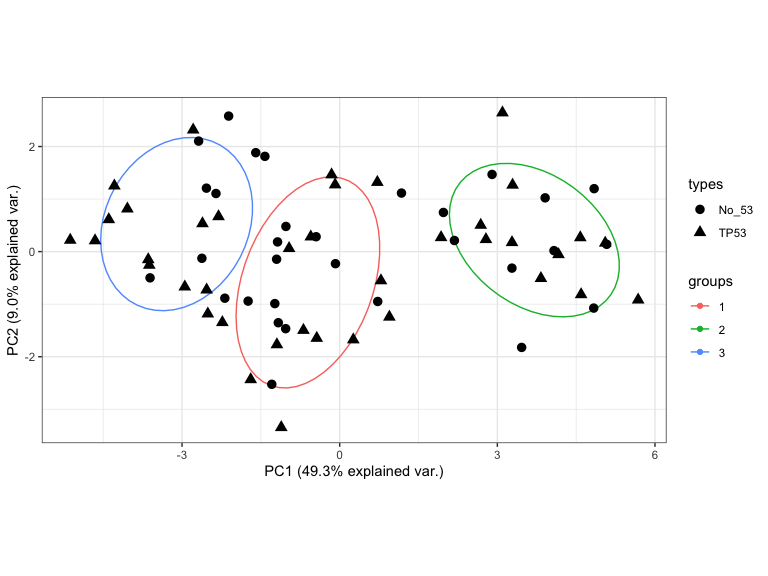

PCA at this stage does not show the distinction between the subgroups of mutations and clusters. Maybe higher dimentions would reveal some extra patterns.

Network Inference
-----------------

Now that we have small number of features and enough samples, let's do state of the art link prediction. For this, I will use `GENIE3` library which uses random forest predictions. I will run the model to contrast the differential expression network that is produced by mRNA data and protein data.

First let's generate the network on the protein data. Like the other network models, the choice of cut-off are subjective. Here, I chose based on the density of the GENIE3 matrix.

``` r
library(GENIE3)
library(GGally)
library(sna)
 
weightMat <- GENIE3(data.matrix(prot.fitlered))

weightMat[weightMat < 0.1] <- 0
weightMat[weightMat > 0.1] <- 1


prot.network <- network::as.network.matrix(weightMat)
set.seed(2)
ggnet2(prot.network, node.label = colnames(weightMat), 
       arrow.size = 5,label.size = 5,label.trim = T,arrow.gap = 0.01915,
        mode = "fruchtermanreingold", 
       layout.par = list(cell.jitter =0.001, niter = 1000 )) +
 theme(legend.position="none",
          legend.title=element_blank())
```

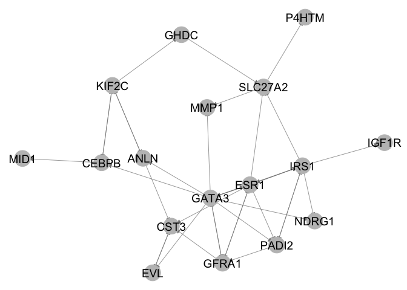

Moving on to extracting mRNA network. I will use the same parameters.

``` r
weightMat2 <- GENIE3(data.matrix(mRNA.fitlered))

weightMat2[weightMat2 < 0.1] <- 0
weightMat2[weightMat2 > 0.1] <- 1


mRNA.network <- network::as.network.matrix(weightMat2)
set.seed(2)
ggnet2(mRNA.network, node.label = colnames(weightMat2), 
       arrow.size = 5,label.size = 5,label.trim = T,arrow.gap = 0.01915,
       mode = "fruchtermanreingold", layout.par = list(cell.jitter =0.001,
                                                       niter = 1000 )) +
theme(legend.position="none",
      legend.title=element_blank())
```

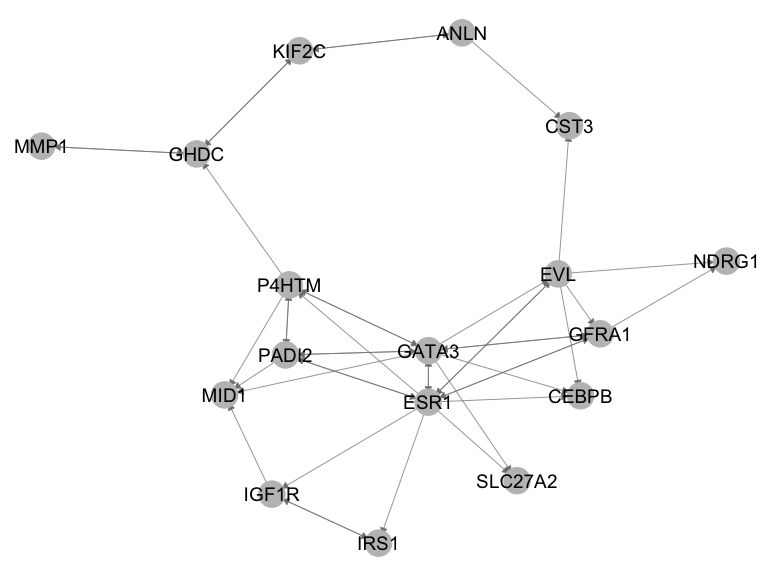

As it shows, there are overlaps between the two networks. However, there are differences as well, which is expected because the nature of the two data differ. We will report the combined network. Also, I ran the genes at STRING DB to get the known or independently predicted interactions. There were 9 interactions returned from the STRING DB. The STRING DB table is stored in the `Data` folder.

``` r
weightMat3 <- weightMat2 + weightMat 
weightMat3[weightMat3 >0 ] <- 1


string.table <- read.csv("Data/string_interactions.tsv", 
                         stringsAsFactors = F, sep = "\t")
string.table <- string.table[,c(1,2)]


for ( i in 1:nrow(string.table)){
     from <- string.table[1,i]
     to   <- string.table[2,i]
     weightMat3[from,to] <- weightMat3[from,to] + 2
     weightMat3[to,from] <- weightMat3[to,from] + 2
}


comb.network <- network::as.network.matrix(weightMat3,
                                            names.eval = "weights",
                                            ignore.eval = FALSE)

set.seed(2)
network::set.edge.attribute(comb.network, "lty", 
                            ifelse(comb.network %e% "weights" < 2, 1, 2))
ggnet2(comb.network,   label = TRUE, edge.size = "weights",
       edge.color = "weights",edge.lty = "lty",arrow.gap = 0.01915)
```

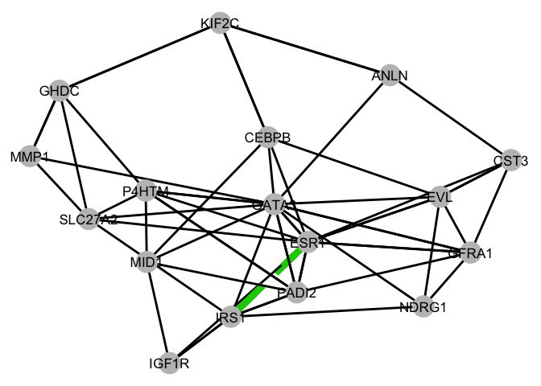

GENIE3 discoveres 8 out of the 9 known interactions. The only one that is missing is highlighted in the dashed line. The rest of the network is novel and is subject to confirmation.
